# haproxy安装和配置

有关高负载均衡的软件，目前使用比较多的是haproxy、nginx和lvs。下面我们就开始学习haprxoy这款软件。

## 一、haproxy介绍

以下开始介绍有关haproxy的原理及其优点。

### 1.1、haproxy原理

haproxy提供高可用性、负载均衡以及基于TCP(第四层)和HTTP（第七层）应用的代理，支持虚拟主机，它是免费、快速并且可靠的一种解决方案。

haproxy特别适用于那些负载特别大的web站点，这些站点通常又需要会话保持或七层处理。haproxy运行在时下的硬件上，完全可以支持数以万计的并发连接，并且它的运行模式使得它可以很简单安全的整合进您当前的架构中，同时可以保护你的web服务器不被暴露到网络上。

haproxy实现了一种事件驱动、单一进程模型，此模型支持非常大的并发连接数。多进程或多线程模型受内存限制、系统调度器限制以及无处不在的锁限制，很少能处理数千并发连接。

事件驱动模型因为在有更好的资源和时间管理的用户端(User-Space)实现所有这些任务，所以没有这些问题。此模型的弊端是，在多核系统上，这些程序通常扩展性较差。这就是为什么他们必须进行优化以使每个CPU时间片(Cycle)做更多的工作。

### 1.2、haproxy的优点

1. 免费开源，稳定性也是非常好。单haproxy也跑得不错，稳定性可以与硬件级的F5相媲美。

2. 根据官方文档，haproxy可以跑满10Gbps，这个数值作为软件级负载均衡器是相当惊人的。

3. haproxy支持连接拒绝:因为维护一个连接的打开的开销是很低的，有时我们很需要限制攻击蠕虫（attack bots），也就是说限制它们的连接打开从而限制它们的危害。这个已经为一个陷于小型DDoS攻击的网站开发了而且已经拯救了很多站点，这个优点也是其它负载均衡器没有的。

4. haproxy支持全透明代理（已具备硬件防火墙的典型特点）:可以用客户端IP地址或者任何其他地址来连接后端服务器。这个特性仅在Linux 2.4/2.6内核打了tcp proxy补丁后才可以使用。这个特性也使得为某特殊服务器处理部分流量同时又不修改服务器的地址成为可能。

5. haproxy现多于线上的Mysql集群环境，我们常用于它作为MySQL（读）负载均衡。

6. 自带强大的监控服务器状态的页面，实际环境中我们结合Nagios进行邮件或短信报警。

7. HAProxy支持虚拟主机，许多朋友说它不支持虚拟主机是错误的，通过测试我们知道，HAProxy是支持虚拟主机的。

## 二、业务架构图

现在我们以实际的业务架构图，来使用haproxy。业务架构图如下：
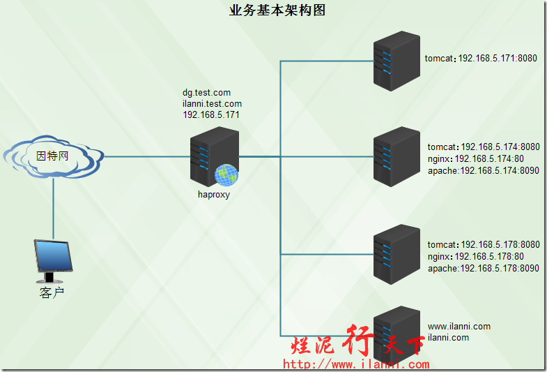

这个是基本的业务架构图，对外是haproxy这台服务器。目前暂时没有考虑haproxy的单点故障问题，这个问题我们会在后续的keepalived文章中会进行介绍。

现在要求如下：

### 2.1、域名跳转

客户端访问`http://dg.test.com`时，要把请求分发到`192.168.5.171:8080、192.168.5.174:8080、192.168.5.178:8080`，这三台服务器上。

客户端访问`http://ilanni.test.com`时，要把请求分发到`ilanni.com`，这台服务器上。

### 2.2、IP地址跳转

客户端访问`http://192.168.5.171`时，要把请求分发到192.168.5.174:80、192.168.5.178:80这两台服务器上。同时还要求客户端每一次访问，都跳转到不同的服务器上。

### 2.3、端口跳转

客户端访问`http://dg.test.com:8090`和`http://ilanni.test.com:8090`这两个地址时，要把请求分发到`192.168.5.174:8090、192.168.5.178:8090`，这两台服务器上。

### 2.4、默认跳转

如果客户端访问的不是`dg.test.com`与192.168.5.171，这两个地址的话，要把请求全部分发到192.168.5.178:8080上。

### 2.5、多ACL匹配

如果客户端的IP是192.168.5.140，同时访问的是`http://192.168.5.171`时，要把请求分发到`www.ilanni.com`上。

## 三、安装haproxy

haproxy的官网是`http://www.haproxy.org/`，如果打不开此站点，请FQ（如何FQ，联系我哦）。

haproxy的安装我们可以分为源码方式和apt-get方式。下面对其安装方式进行一一讲解。

### 3.1 源码方式安装haproxy

haprxoy目前最新的版本为1.6，为了业务的稳定，在此我们选择的是`1.3.15.27`这个版本。

在进行源码安装之前，首先要安装相关的软件库。如下：

```
sudo apt-get -y install make gcc
```

创建运行haproxy时，使用的用户。在此我们使用haproxy这个用户，而且此用户不能登录到系统。如下：
```
sudo useradd -m haproxy
cat /etc/passwd |grep haproxy
```

我们可以看到haproxy用户及用户组的ID均为1005。

现在开始下载源码包如下：

```
wget http://www.haproxy.org/download/1.3/src/haproxy-1.3.15.27.tar.gz
```

解压源码包，如下：

```
tar -xf haproxy-1.3.15.27.tar.gz
cd haproxy-1.3.15.27/
```

编译安装haproxy需要的软件库。除此之外还需要选择OS的内核版本，linux2.6以上的版本，我们都选择linux26。通过查看安装文档，我们可以很清楚的看出要编译haproxy，我们首先要知道OS内核版本以及OS的位数。如下：

```
uname –a
```

我们可以很容易的看出linux内核的版本与OS的位数。现在开始编译haproxy，如下：
```
make TARGET=linux26 ARCH=x86_64 PREFIX=/usr/local/haproxy
```

其中TARGET表示OS的内核版本，ARCH表示OS的位数，PREFIX表示haprxoy的安装路径。现在开始安装haproxy，如下：
```
sudo make install PREFIX=/usr/local/haproxy
```

查看安装后的文件，如下：
```
ll /usr/local/haproxy/
```

编辑haproxy的配置文件，haproxy默认给我们提供一个配置文件模版。如下：
```
sudo cp examples/haproxy.cfg /usr/local/haproxy/
```

查看haprxoy的版本，如下：
```
/usr/local/haproxy/sbin/haproxy -v
```

可以看到haproxy的版本确实是1.3.27。有关haproxy的配置实例见第三章。

### 3.2 apt-get方式安装haproxy

apt-get方式安装haproxy，如下：
```
sudo apt-get -y install haproxy
```

查看haproxy安装的文件
```
dpkg -L haproxy
```

安装完毕后，haproxy默认已经启动。如下：
```
ps -ef |grep haproxy
```

查看haproxy版本,如下：
```
haproxy -v
```

通过上图，我们知道现在haproxy的版本为1.5.4。

注意：apt-get方式安装haproxy，如果版本为1.4.24的话。我们一定要修改`/etc/default/haproxy`，如下：
```
sudo vi /etc/default/haproxy
```

如果不修改的话，使用haproxy启动脚本的话，是没有用处的，也就说脚本不会重新加载haproxy的配置。查看haproxy的配置文件,如下：
```
cat /etc/haproxy/haproxy.cfg
```

我们可以很明显的看出默认的配置文件里面是没有内容的。

## 四、配置haprxoy

haproxy安装完毕后，我们来配置haproxy。源码安装的haprxoy在前面我们已经讲解了，haproxy提供的配置模版haproxy.cfg。

### 4.1、haproxy配置实例

我们现在就以这个模版为例，配置haproxy。haproxy配置文件内容，如下：
```
grep -vE "^#|^$" haproxy.cfg
```

```

global
	log 127.0.0.1 local0
	log 127.0.0.1 local1 notice
	maxconn 4096
	uid 1005
	gid 1005
	daemon
defaults
	log global
	mode http
	option httplog
	option dontlognull
	retries 3
	option redispatch
	maxconn 2000
	contimeout 5000
	clitimeout 50000
	srvtimeout 50000
listen admin_stats
	bind 192.168.5.171:1080
	mode http
	option httplog
	maxconn 10
	stats refresh 30s
	stats uri /stats
	stats auth admin:admin
	stats hide-version
frontend weblb
	bind *:80
	acl is_dg hdr_beg(host) dg.test.com
	acl is_ilanni hdr_beg(host) ilanni.test.com
	acl is_171 hdr_beg(host) 192.168.5.171
	acl is_ip src 192.168.5.140
	use_backend acl if is_171 is_ip
	use_backend dgserver if is_dg
	use_backend ilanni if is_ilanni
	use_backend 171server if is_171
	default_backend backend_default
backend dgserver
balance source
	server web1 192.168.5.171:8080 maxconn 1024 weight 3 check inter 2000 rise 2 fall 3
	server web2 192.168.5.174:8080 maxconn 1024 weight 3 check inter 2000 rise 2 fall 3
	server web3 192.168.5.178:8080 maxconn 1024 weight 3 check inter 2000 rise 2 fall 3
backend 171server
balance roundrobin
	server dg1 192.168.5.174:80 check
	server dg2 192.168.5.178:80 check
backend ilanni
	server web1 www.yuanbaopu.com:80 weight 3 check inter 2000 rise 2 fall 3
backend acl
balance source
	server web1 www.ilanni.com:80 maxconn 1024 weight 3 check inter 2000 rise 2 fall 3
backend backend_default
	server web1 192.168.5.178:8080 weight 3 check inter 2000 rise 2 fall 3
listen 8090
	bind 0.0.0.0:8090
	mode http
	balance roundrobin
	server web1 192.168.5.174:8090 maxconn 1024 weight 5 check inter 2000 rise 2 fall 3
	server web2 192.168.5.178:8090 maxconn 1024 weight 3 check inter 2000 rise 2 fall 3
```

### 4.2、haproxy配置实例讲解

有关haproxy配置文件我们先简单介绍，如下：
- global：配置段，用于设定全局配置参数。代理配置段中，主要是使用defaults、frontend、backend、listen关键词。
- defaults：配置段用于为所有其它配置段提供默认参数，这配置默认配置参数可由下一个“defaults”所重新设定。
- frontend：配置段用于定义一系列监听的套接字，这些套接字可接受客户端请求并与之建立连接。
- backend：配置段用于定义一系列“后端”服务器，代理将会将对应客户端的请求转发至这些服务器。
- listen：配置段通过关联“前端”和“后端”定义了一个完整的代理，通常只对TCP流量有用。在上述haproxy配置文件中，我们主要讲解ACL的匹配规则。
- acl is_dg hdr_beg(host) dg.test.com：该行定义一个is_dg规则，如果客户端请求的是dg.test.com这个域名，则定义该规则为is_dg。
- use_backend dgserver if is_dg：该定义一个dgserver服务器组，如果客户端请求符合is_dg定义的规则，则把该客户端的请求分发到dgserver服务器组。
- acl is_ip src 192.168.5.140：该行定义一个is_ip规则，如果客户端的IP地址是192.168.5.140，则定义该规则为is_ip。
- use_backend acl if is_171 is_ip：该定义一个acl服务器组，如果客户端请求同时符合is_ip和is_171定义的规则，则把该客户端的请求分发到acl服务器组。
- default_backend backend_default：该行定义一个默认服务器组，如果客户端请求不符合上述定义的任何一个规则，则把该客户端的请求分发到backend_default服务器组。

其他的规则就不一一进行讲解了。以上就是按照目前的业务要求，配置的haproxy。有关这些配置项参数，我们会在下一篇文章中进行详细介绍。

## 五、查看haproxy监控页面

haproxy配置完毕后，现在来启动haproxy，使用如下命令：

```
/usr/local/haproxy/sbin/haproxy -f /usr/local/haproxy/haproxy.cfg
ps -ef |grep haproxy
netstat -tunlp|grep 3173
```

现在我们来打开haproxy的监控页面，如下：

```
http://192.168.5.171:1080/stats
```

输入用户名和密码后，haproxy监控后台服务器的情况，如下：
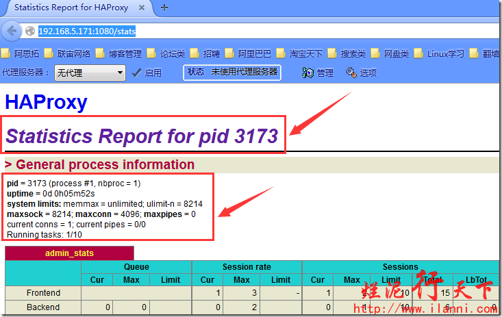

现在我们来看看haprxoy所有后台服务器的情况，先来看看dgserver组，如下：
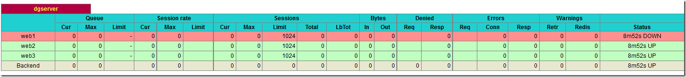

通过上图，我们可以看到dgserver组，目前web1这台服务器处于宕机状态。也就是说haprxoy不会把客户端的请求分发到web1服务器上了。

现在我们再来看看171server组，如下：
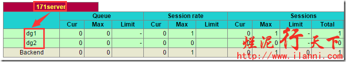

通过上图，我们可以很明显的看出171server组的服务器目前都是正常运行的。

8090组服务器的情况，如下：
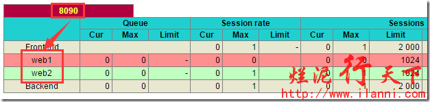

通过上图，我们可以看到8090组的服务器也是有一台是宕机的。

## 六、测试haproxy负载均衡

haprxoy配置完毕并正常启动后，我们现在来根据业务的要求进行测试。

6.1 测试域名跳转

使用如下命令测试域名跳转：

```
curl http://dg.test.com
```

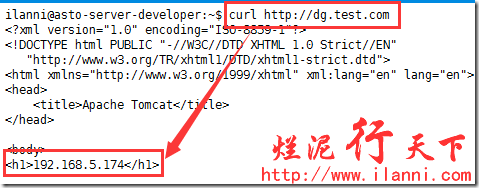
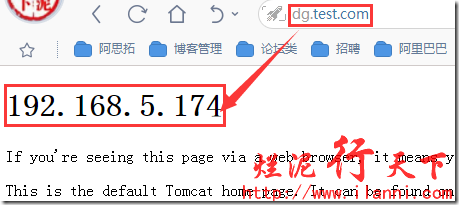

通过上图，我们可以看到当我们使用dg.test.com这个域名访问时，haproxy确实为我们进行跳转了，而且跳转到了192.168.5.174这台服务器上。

因为考虑到客户端session会话的问题，所以我们在配置haproxy负载均衡没有使用roundrobin轮询的方法，而是使用source方法。所以haproxy目前没有把请求分发到192.168.5.171:8080、192.168.5.178:8080这两台服务器上。

现在我们访问ilanni.test.com，如下：
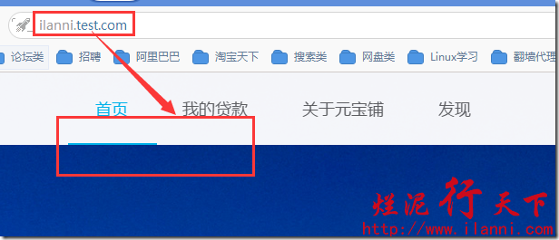

## 通过上图，我们可以看到访问不同的域名，haproxy把请求分发到不同的服务器上。

6.2 测试IP地址跳转

使用如下命令测试IP地址跳转：
```
curl http://192.168.5.171
```

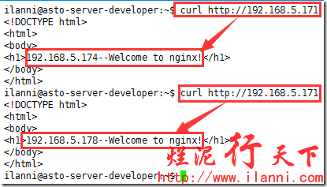

通过上图，我们可以很明显的看到，第一次使用`curl http://192.168.5.171`访问时，haproxy是把请求分发171server组的192.168.5.174这台机器上。而第二次访问时，把请求分发171server组的192.168.5.178这台机器上。

因为在haproxy配置中，我们使用的是roundrobin轮询方法，所以客户端的每一次请求，haproxy会把请求分发到不同的服务器上。

### 6.3 测试端口跳转

使用如下命令测试IP地址跳转：
```
curl http://dg.test.com:8090
curl http://ilanni.test.com:8090
```

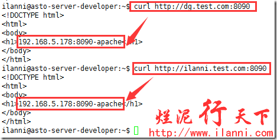

通过上图，我们可以很明显的看到客户端在通过`dg.test.com:8090`和`ilanni.test.com:8090`进行访问时，haproxy确实把请求分发到了8090组服务器上的`192.168.5.178:8090`上。

### 6.4 测试默认跳转

要测试默认跳转，我们可以随便使用一个域名进行测试。如下：
```
curl http://test.test.com
```

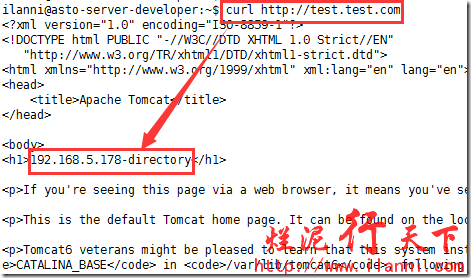

通过上图，我们可以很明显的看出haproxy把`test.test.com`的请求转发到了默认服务器组的`192.168.5.178:8080`上。

### 6.5 测试多ACL匹配

要测试默认跳转，我们先切换到`192.168.5.140`这台机器上，然后访问`http://192.168.5.171`。如下：
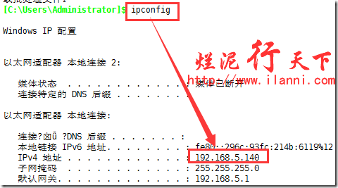

通过上图，我们可以很明显的看到在`192.168.5.171`这台机器上访问`http://192.168.5.171`时，haproxy确实把请求分发到`www.ilanni.com`这台机器上。

## 七、centos安装haproxy

有关在centos上安装haproxy，我们在此就不多做介绍了。只把相关的操作命令贴出来。

yum方式安装：`yum -y install haproxy`

源码方式安装：
```
useradd haproxy

cat /etc/passwd |grep haproxy

uname –a

yum -y install gcc make

wget http://www.haproxy.org/download/1.3/src/haproxy-1.3.27.tar.gz

tar -xf haproxy-1.3.27.tar.gz

cd haproxy-1.3.27

make TARGET=linux26 ARCH=x86_64 PREFIX=/usr/local/haproxy

make install PREFIX=/usr/local/haproxy
```
