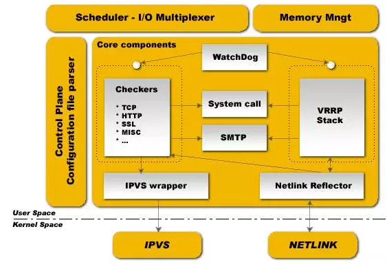

# keepalived介绍

keepalived观察其名可知，保持存活，在网络里面就是保持在线了，也就是所谓的高可用或热备，它集群管理中保证集群高可用的一个服务软件，其功能类似于heartbeat，用来防止单点故障(单点故障是指一旦某一点出现故障就会导致整个系统架构的不可用)的发生。说到keepalived就不得不说VRRP协议，可以说这个协议就是keepalived实现的基础，那么首先我们来看看VRRP协议。

## VRRP协议介绍

学过网络的朋友都知道，网络在设计的时候必须考虑到冗余容灾，包括线路冗余，设备冗余等，防止网络存在单点故障，那在路由器或三层交换机处实现冗余就显得尤为重要。

在网络里面有个协议就是来做这事的，这个协议就是VRRP协议，Keepalived就是巧用VRRP协议来实现高可用性(HA)的发生。
VRRP全称Virtual Router Redundancy Protocol，即虚拟路由冗余协议。对于VRRP，需要清楚知道的是：

1. VRRP是用来实现路由器冗余的协议。
2. VRRP协议是为了消除在静态缺省路由环境下路由器单点故障引起的网络失效而设计的主备模式的协议，使得发生故障而进行设计设备功能切换时可以不影响内外数据通信，不需要再修改内部网络的网络参数。
3. VRRP协议需要具有IP备份，优先路由选择，减少不必要的路由器通信等功能。
4. VRRP协议将两台或多台路由器设备虚拟成一个设备，对外提供虚拟路由器IP（一个或多个）。然而，在路由器组内部，如果实际拥有这个对外IP的路由器如果工作正常的话，就是master，或者是通过算法选举产生的，MASTER实现针对虚拟路由器IP的各种网络功能，如ARP请求，ICMP，以及数据的转发等，其他设备不具有该IP，状态是BACKUP。除了接收MASTER的VRRP状态通告信息外，不执行对外的网络功能，当主级失效时，BACKUP将接管原先MASTER的网络功能。
5. VRRP协议配置时，需要配置每个路由器的虚拟路由ID(VRID)和优先权值，使用VRID将路由器进行分组，具有相同VRID值的路由器为同一个组，VRID是一个0-255的整整数，；同一个组中的路由器通过使用优先权值来选举MASTER。，优先权大者为MASTER，优先权也是一个0-255的正整数。

## keepalived工作原理
keepalived可提供vrrp以及health-check功能，可以只用它提供双机浮动的vip（vrrp虚拟路由功能），这样可以简单实现一个双机热备高可用功能；keepalived是以VRRP虚拟路由冗余协议为基础实现高可用的，可以认为是实现路由器高可用的协议，即将N台提供相同功能的路由器组成一个路由器组，这个组里面有一个master和多个backup，master上面有一个对外提供服务的vip（该路由器所在局域网内其他机器的默认路由为该vip），master会发组播，当backup收不到VRRP包时就认为master宕掉了，这时就需要根据VRRP的优先级来选举一个backup当master。这样的话就可以保证路由器的高可用了。

下图是keepalived的组件图



keepalived也是模块化设计，不同模块复杂不同的功能，它主要有三个模块，分别是core、check和VRRP，其中：
- core模块：为keepalived的核心组件，负责主进程的启动、维护以及全局配置文件的加载和解析；
- check：负责健康检查，包括常见的各种检查方式；
- VRRP模块：是来实现VRRP协议的。
- system call：系统调用
- watch dog：监控check和vrrp进程的看管者，check负责检测器子进程的健康状态，当其检测到master上的服务不可用时则通告vrrp将其转移至backup服务器上。

除此之外，keepalived还有下面两个组件：
- libipfwc：iptables(ipchains)库，配置LVS会用到
- libipvs*：配置LVS会用到

注意，keepalived和LVS完全是两码事，只不过他们各负其责相互配合而已。

keepalived正常启动的时候，共启动3个进程：
一个是父进程，负责监控其子进程；一个是VRRP子进程，另外一个是checkers子进程；
两个子进程都被系统watchlog看管，两个子进程各自负责复杂自己的事。
Healthcheck子进程检查各自服务器的健康状况，，例如http,lvs。如果healthchecks进程检查到master上服务不可用了，就会通知本机上的VRRP子进程，让他删除通告，并且去掉虚拟IP，转换为BACKUP状态。

## Keepalived作用
Keepalived主要用作RealServer的健康状态检查以及LoadBalance主机和BackUP主机之间failover的实现。Keepalived的作用是检测web服务器的状态，如果有一台web服务器死机，或工作出现故障，Keepalived将检测到，并将有故障的web服务器从系统中剔除，当web服务器工作正常后Keepalived自动将web服务器加入到服务器群中，这些工作全部自动完成，不需要人工干涉，需要人工做的只是修复故障的web服务器。

Keepalived和Heartbeat之间的对比
1. Keepalived使用更简单：从安装、配置、使用、维护等角度上对比，Keepalived都比Heartbeat要简单得多，尤其是Heartbeat2.1.4后拆分成3个子项目，安装、配置、使用都比较复杂，尤其是出问题的时候，都不知道具体是哪个子系统出问题了；而Keepalived只有1个安装文件、1个配置文件，配置文件也简单很多；
2. Heartbeat功能更强大：Heartbeat虽然复杂，但功能更强大，配套工具更全，适合做大型集群管理，而Keepalived主要用于集群倒换，基本没有管理功能；
3. 协议不同：Keepalived使用VRRP协议进行通信和选举，Heartbeat使用心跳进行通信和选举；Heartbeat除了走网络外，还可以通过串口通信，貌似更可靠；
Keepalived使用的vrrp协议方式，虚拟路由冗余协议 ；Heartbeat是基于主机或网络的服务的高可用方式；
Keepalived的目的是模拟路由器的双机；Heartbeat的目的是用户service的双机
4. 使用方式基本类似：如果要基于两者设计高可用方案，最终都要根据业务需要写自定义的脚本，Keepalived的脚本没有任何约束，随便怎么写都可以；Heartbeat的脚本有约束，即要支持service start/stop/restart这种方式，而且Heartbeart提供了很多默认脚本，简单的绑定ip，启动apache等操作都已经有了；

### 使用建议：
- 优先使用Keepalived，当Keepalived不够用的时候才选择Heartbeat
- lvs的高可用建议用Keepavlived
- 业务的高可用用Heartbeat

## keepalived的配置文件
keepalived只有一个配置文件keepalived.conf，配置文件里面主要包括以下几个配置项，分别是global_defs、static_ipaddress、static_routes、VRRP_script、VRRP_instance和virtual_server。
总的来说，keepalived主要有三类区域配置，注意不是三种配置文件，是一个配置文件里面三种不同类别的配置区域：
1. 全局配置(Global Configuration)
2. VRRPD配置
3. LVS配置

下面就重点来说说这三类区域的配置：

1. 全局配置
- 全局配置又包括两个子配置：
- 全局定义(global definition)
- 静态路由配置(static ipaddress/routes)

全局定义(global definition)配置范例：
 ```
 global_defs {
notification_email {
admin@example.com
}
 
notification_email_from admin@example.com
smtp_server 127.0.0.1
stmp_connect_timeout 30
router_id node1
}
 ```

表示keepalived在发生诸如切换操作时需要发送email通知，以及email发送给哪些邮件地址，邮件地址可以多个，每行一个

- notification_email_from admin@example.com 表示发送通知邮件时邮件源地址是谁
- smtp_server 127.0.0.1 表示发送email时使用的smtp服务器地址，这里可以用本地的sendmail来实现
- smtp_connect_timeout 30 连接smtp连接超时时间
- router_id node1 机器标识

静态地址和路由配置范例
```
static_ipaddress {
192.168.1.1/24 brd + dev eth0 scope global
192.168.1.2/24 brd + dev eth1 scope global
}
 
static_routes {
src $SRC_IP to $DST_IP dev $SRC_DEVICE
src $SRC_IP to $DST_IP via $GW dev $SRC_DEVICE
}
```

这里实际上和系统里面用命令配置IP地址和路由的曹一样，例如：
192.168.1.1/24 brd + dev eth0 scope global 相当于: ip addr add 192.168.1.1/24 brd + dev eth0 scope global
就是给eth0配置IP地址

路由同理
一般这个区域不需要配置
这里实际上就是给服务器配置真实的IP地址和路由的，在复杂的环境下可能需要配置，一般不会用这个来配置，我们可以直接用vi /etc/sysconfig/network-script/ifcfg-eth1来配置，切记这里可不是VIP哦，不要搞混淆了，切记切记！

2. VRRPD配置
VRRPD配置包括三个类：
- VRRP同步组(synchroization group)
- VRRP实例(VRRP Instance)
- VRRP脚本


VRRP同步组(synchroization group)配置范例

```
vrrp_sync_group VG_1 {
group {
http
mysql
}
notify_master /path/to/to_master.sh
notify_backup /path_to/to_backup.sh
notify_fault “/path/fault.sh VG_1”
notify /path/to/notify.sh
smtp_alert
}
```

其中：
```
group {
http
mysql
}
```

http和mysql是实例名和下面的实例名一致

- notify_master /path/to/to_master.sh：表示当切换到master状态时，要执行的脚本
- notify_backup /path_to/to_backup.sh：表示当切换到backup状态时，要执行的脚本
- notify_fault “/path/fault.sh VG_1”
- notify /path/to/notify.sh：
- smtp alter表示切换时给global defs中定义的邮件地址发送右键通知

VRRP实例(instance)配置范例

```
vrrp_instance http {
state MASTER
interface eth0
dont_track_primary
track_interface {
eth0
eth1
}
mcast_src_ip <IPADDR>
garp_master_delay 10
virtual_router_id 51
priority 100
advert_int 1
authentication {
auth_type PASS
autp_pass 1234
}
virtual_ipaddress {
#<IPADDR>/<MASK> brd <IPADDR> dev <STRING> scope <SCOPT> label <LABEL>
192.168.200.17/24 dev eth1
192.168.200.18/24 dev eth2 label eth2:1
}
virtual_routes {
# src <IPADDR> [to] <IPADDR>/<MASK> via|gw <IPADDR> dev <STRING> scope <SCOPE> tab
src 192.168.100.1 to 192.168.109.0/24 via 192.168.200.254 dev eth1
192.168.110.0/24 via 192.168.200.254 dev eth1
192.168.111.0/24 dev eth2
192.168.112.0/24 via 192.168.100.254
}
nopreempt
preemtp_delay 300
debug
}
```

- state：state指定instance(Initial)的初始状态，就是说在配置好后，这台服务器的初始状态就是这里指定的，但这里指定的不算，还是得要通过竞选通过优先级来确定，里如果这里设置为master，但如若他的优先级不及另外一台，那么这台在发送通告时，会发送自己的优先级，另外一台发现优先级不如自己的高，那么他会就回抢占为master
- interface：实例绑定的网卡，因为在配置虚拟IP的时候必须是在已有的网卡上添加的
- dont track primary：忽略VRRP的interface错误
- track interface：跟踪接口，设置额外的监控，里面任意一块网卡出现问题，都会进入故障(FAULT)状态，例如，用nginx做均衡器的时候，内网必须正常工作，如果内网出问题了，这个均衡器也就无法运作了，所以必须对内外网同时做健康检查
- mcast src ip：发送多播数据包时的源IP地址，这里注意了，这里实际上就是在那个地址上发送VRRP通告，这个非常重要，一定要选择稳定的网卡端口来发送，这里相当于heartbeat的心跳端口，如果没有设置那么就用默认的绑定的网卡的IP，也就是interface指定的IP地址
- garp master delay：在切换到master状态后，延迟进行免费的ARP(gratuitous ARP)请求
- virtual router id：这里设置VRID，这里非常重要，相同的VRID为一个组，他将决定多播的MAC地址
- priority 100：设置本节点的优先级，优先级高的为master
- advert int：检查间隔，默认为1秒
- virtual ipaddress：这里设置的就是VIP，也就是虚拟IP地址，他随着state的变化而增加删除，当state为master的时候就添加，当state为backup的时候删除，这里主要是有优先级来决定的，和state设置的值没有多大关系，这里可以设置多个IP地址
- virtual routes：原理和virtual ipaddress一样，只不过这里是增加和删除路由
- lvs sync daemon interface：lvs syncd绑定的网卡
- authentication：这里设置认证
- auth type：认证方式，可以是PASS或AH两种认证方式
- auth pass：认证密码
- nopreempt：设置不抢占，这里只能设置在state为backup的节点上，而且这个节点的优先级必须别另外的高
- preempt delay：抢占延迟
- debug：debug级别
- notify master：和sync group这里设置的含义一样，可以单独设置，例如不同的实例通知不同的管理人员，http实例发给网站管理员，mysql的就发邮件给DBA

VRRP脚本范例
```
vrrp_script check_running {
   script “/usr/local/bin/check_running”
   interval 10
   weight 10
}
vrrp_instance http {
   state BACKUP
   smtp_alert
   interface eth0
   virtual_router_id 101
   priority 90
   advert_int 3
   authentication {
   auth_type PASS
   auth_pass whatever
   }
   virtual_ipaddress {
   1.1.1.1
   }
   track_script {
   check_running weight 20
   }
}
```

首先在vrrp_script区域定义脚本名字和脚本执行的间隔和脚本执行的优先级变更vrrp_script check_running {
```
script “/usr/local/bin/check_running”
interval 10     #脚本执行间隔
weight 10      #脚本结果导致的优先级变更：10表示优先级+10；-10则表示优先级-10
}
```

然后在实例(vrrp_instance)里面引用，有点类似脚本里面的函数引用一样：先定义，后引用函数名
```
track_script {
check_running weight 20
}
```

注意：VRRP脚本(vrrp_script)和VRRP实例(vrrp_instance)属于同一个级别

LVS配置

如果你没有配置LVS+keepalived，那么无需配置这段区域，如果你用的是nginx来代替LVS，这无需配置这款，这里的LVS配置是专门为keepalived+LVS集成准备的。
注意了，这里LVS配置并不是指真的安装LVS然后用ipvsadm来配置它，而是用keepalived的配置文件来代替ipvsadm来配置LVS，这样会方便很多，一个配置文件搞定这些，维护方便，配置方便是也！

这里LVS配置也有两个配置
- 一个是虚拟主机组配置
- 一个是虚拟主机配置

虚拟主机组配置文件详解

这个配置是可选的，根据需求来配置吧，这里配置主要是为了让一台realserver上的某个服务可以属于多个Virtual Server，并且只做一次健康检查:
`virtual_server_group <STRING> { # VIP port <IPADDR> <PORT> <IPADDR> <PORT> fwmark <INT> }`

虚拟主机配置

virtual server可以以下面三种的任意一种来配置:
- a）virtual server IP port
- b）virtual server fwmark int
- c）virtual server group string

下面以第一种比较常用的方式来配详细解说一下：

```
virtual_server 192.168.1.2 80 {                     #设置一个virtual server: VIP:Vport
delay_loop 3                                        #service polling的delay时间，即服务轮询的时间间隔
 
lb_algo rr|wrr|lc|wlc|lblc|sh|dh                    #LVS调度算法
lb_kind NAT|DR|TUN                                  #LVS集群模式                     
persistence_timeout 120                             #会话保持时间（秒为单位），即以用户在120秒内被分配到同一个后端realserver
persistence_granularity <NETMASK>                   #LVS会话保持粒度，ipvsadm中的-M参数，默认是0xffffffff，即每个客户端都做会话保持
protocol TCP                                        #健康检查用的是TCP还是UDP
ha_suspend                                          #suspendhealthchecker’s activity
virtualhost <string>                                #HTTP_GET做健康检查时，检查的web服务器的虚拟主机（即host：头）
 
sorry_server <IPADDR> <PORT>                 #备用机，就是当所有后端realserver节点都不可用时，就用这里设置的，也就是临时把所有的请求都发送到这里啦
 
real_server <IPADDR> <PORT>                  #后端真实节点主机的权重等设置，主要，后端有几台这里就要设置几个
{
weight 1                                                      #给每台的权重，0表示失效(不知给他转发请求知道他恢复正常)，默认是1
inhibit_on_failure                                            #表示在节点失败后，把他权重设置成0，而不是冲IPVS中删除
 
notify_up <STRING> | <QUOTED-STRING>         #检查服务器正常(UP)后，要执行的脚本
notify_down <STRING> | <QUOTED-STRING>       #检查服务器失败(down)后，要执行的脚本
HTTP_GET                                                   #健康检查方式
{
url {                                                      #要坚持的URL，可以有多个
path /                                                     #具体路径
digest <STRING>                                           
status_code 200                                            #返回状态码
}
connect_port 80                                            #监控检查的端口
 
bindto <IPADD>                                             #健康检查的IP地址
connect_timeout   3                                        #连接超时时间
nb_get_retry 3                                             #重连次数
delay_before_retry 2                                       #重连间隔
} # END OF HTTP_GET|SSL_GET
 
#下面是常用的健康检查方式，健康检查方式一共有HTTP_GET|SSL_GET|TCP_CHECK|SMTP_CHECK|MISC_CHECK这些
#TCP方式
TCP_CHECK {
connect_port 80
bindto 192.168.1.1
connect_timeout 4
} # TCP_CHECK
 
# SMTP方式，这个可以用来给邮件服务器做集群
SMTP_CHECK
host {
connect_ip <IP ADDRESS>
connect_port <PORT>                                     #默认检查25端口
14 KEEPALIVED
bindto <IP ADDRESS>
}
connect_timeout <INTEGER>
retry <INTEGER>
delay_before_retry <INTEGER>
helo_name <STRING>|<QUOTED-STRING>
} #SMTP_CHECK
 
#MISC方式，这个可以用来检查很多服务器只需要自己会些脚本即可
MISC_CHECK
{
misc_path <STRING>|<QUOTED-STRING> #外部程序或脚本
misc_timeout <INT>                                    #脚本或程序执行超时时间
 
misc_dynamic                                               #这个就很好用了，可以非常精确的来调整权重，是后端每天服务器的压力都能均衡调配，这个主要是通过执行的程序或脚本返回的状态代码来动态调整weight值，使权重根据真实的后端压力来适当调整，不过这需要有过硬的脚本功夫才行哦
#返回0：健康检查没问题，不修改权重
#返回1：健康检查失败，权重设置为0
#返回2-255：健康检查没问题，但是权重却要根据返回代码修改为返回码-2，例如如果程序或脚本执行后返回的代码为200，#那么权重这回被修改为 200-2
}
} # Realserver
} # Virtual Server
```

## 案例分享

172.16.60.205 作为web-master主节点, 172.16.60.206 作为web-slave从节点, 两节点上都部署nginx.
现在在两节点上部署keepalived, 只做节点故障时vip转移功能, 不做负载均衡功能.
vip为: 172.16.60.129

- 1) 主从两节点部署nginx, 安装和配置过程省略. 配置一样, 访问内容一致!
yum安装的nginx,  启动命令:  /etc/init.d/nginx start
http://172.16.60.205/ 和 http://172.16.60.205/ 均可以正常访问.

- 2) 主从两节点安装keepalived (两个节点都要安装)

```
[root@web-master ~]# yum install -y openssl-devel
[root@web-master ~]# cd /usr/local/src/
[root@web-master src]# wget http://www.keepalived.org/software/keepalived-1.3.5.tar.gz
[root@web-master src]# tar -zvxf keepalived-1.3.5.tar.gz
[root@web-master src]# cd keepalived-1.3.5
[root@web-master keepalived-1.3.5]# ./configure --prefix=/usr/local/keepalived
[root@web-master keepalived-1.3.5]# make && make install
           
[root@web-master keepalived-1.3.5]# cp /usr/local/src/keepalived-1.3.5/keepalived/etc/init.d/keepalived /etc/rc.d/init.d/
[root@web-master keepalived-1.3.5]# cp /usr/local/keepalived/etc/sysconfig/keepalived /etc/sysconfig/
[root@web-master keepalived-1.3.5]# mkdir /etc/keepalived/
[root@web-master keepalived-1.3.5]# cp /usr/local/keepalived/etc/keepalived/keepalived.conf /etc/keepalived/
[root@web-master keepalived-1.3.5]# cp /usr/local/keepalived/sbin/keepalived /usr/sbin/
[root@web-master keepalived-1.3.5]# echo "/etc/init.d/keepalived start" >> /etc/rc.local
     
[root@web-master keepalived-1.3.5]# chmod +x /etc/rc.d/init.d/keepalived     
[root@web-master keepalived-1.3.5]# chkconfig keepalived on                  
```

- 3) keepalived配置

```
==========web-master 主节点的配置==========
[root@web-master ~]# cd /etc/keepalived/
[root@web-master keepalived]# cp keepalived.conf keepalived.conf.bak
[root@web-master keepalived]# >keepalived.conf
[root@web-master keepalived]# vim keepalived.conf
! Configuration File for keepalived
     
global_defs {
   router_id LVS_Master
}
     
vrrp_instance VI_1 {
    state MASTER               #指定instance初始状态，实际根据优先级决定.backup节点不一样
    interface eth0             #虚拟IP所在网
    virtual_router_id 51       #VRID，相同VRID为一个组，决定多播MAC地址
    priority 100               #优先级，另一台改为90.backup节点不一样
    advert_int 1               #检查间隔
    authentication {
        auth_type PASS         #认证方式，可以是pass或ha
        auth_pass 1111         #认证密码
    }
    virtual_ipaddress {
        172.16.60.129         #VIP地址
    }
}
```

```
==========web-slave 从节点的配置==========
[root@web-slave ~]# cd /etc/keepalived/
[root@web-slave keepalived]# cp keepalived.conf keepalived.conf.bak
[root@web-slave keepalived]# >keepalived.conf
[root@web-slave keepalived]# vim keepalived.conf
! Configuration File for keepalived
     
global_defs {
   router_id LVS_Backup
}
     
vrrp_instance VI_1 {
    state BACKUP         
    interface eth0        
    virtual_router_id 51  
    priority 90          
    advert_int 1         
    authentication {
        auth_type PASS    
        auth_pass 1111    
    }
    virtual_ipaddress {
        172.16.60.129 
    }
}
```

- 4) 分别启动主从节点的keepalived服务

启动主节点keepalived服务
```
[root@web-master keepalived]# /etc/init.d/keepalived start
Starting keepalived:                                       [  OK  ]
[root@web-master keepalived]# ps -ef|grep keepalived
root     13529     1  0 16:36 ?        00:00:00 keepalived -D
root     13530 13529  0 16:36 ?        00:00:00 keepalived -D
root     13532 13529  0 16:36 ?        00:00:00 keepalived -D
root     13536  9799  0 16:36 pts/1    00:00:00 grep keepalived
```

启动从节点keepalived服务
```
[root@web-slave keepalived]# /etc/init.d/keepalived start
Starting keepalived:                                       [  OK  ]
[root@web-slave keepalived]# ps -ef|grep keepalived
root      3120     1  0 16:37 ?        00:00:00 keepalived -D
root      3121  3120  0 16:37 ?        00:00:00 keepalived -D
root      3123  3120  0 16:37 ?        00:00:00 keepalived -D
root      3128 27457  0 16:37 pts/2    00:00:00 grep keepalived
```

查看vip资源情况 (默认vip是在主节点上的)
```
[root@web-master keepalived]# ip addr
1: lo: <LOOPBACK,UP,LOWER_UP> mtu 65536 qdisc noqueue state UNKNOWN
    link/loopback 00:00:00:00:00:00 brd 00:00:00:00:00:00
    inet 127.0.0.1/8 scope host lo
    inet6 ::1/128 scope host
       valid_lft forever preferred_lft forever
2: eth0: <BROADCAST,MULTICAST,UP,LOWER_UP> mtu 1500 qdisc mq state UP qlen 1000
    link/ether 00:50:56:88:43:f8 brd ff:ff:ff:ff:ff:ff
    inet 172.16.60.205/24 brd 172.16.60.255 scope global eth0
    inet 172.16.60.129/32 scope global eth0
    inet6 fe80::250:56ff:fe88:43f8/64 scope link
       valid_lft forever preferred_lft forever
```

从节点没有vip资源
```
[root@web-slave keepalived]# ip addr
1: lo: <LOOPBACK,UP,LOWER_UP> mtu 65536 qdisc noqueue state UNKNOWN
    link/loopback 00:00:00:00:00:00 brd 00:00:00:00:00:00
    inet 127.0.0.1/8 scope host lo
    inet6 ::1/128 scope host
       valid_lft forever preferred_lft forever
2: eth0: <BROADCAST,MULTICAST,UP,LOWER_UP> mtu 1500 qdisc mq state UP qlen 1000
    link/ether 00:50:56:ac:50:9b brd ff:ff:ff:ff:ff:ff
    inet 172.16.60.206/24 brd 172.16.60.255 scope global eth0
    inet6 fe80::250:56ff:feac:509b/64 scope link
       valid_lft forever preferred_lft forever
```

- 5) keepalived 实现故障转移 (转移vip资源)

假设主节点宕机或keepalived服务挂掉, 则vip资源就会自动转移到从节点

```
[root@web-master keepalived]# /etc/init.d/keepalived stop
Stopping keepalived:                                       [  OK  ]
[root@web-master keepalived]# ps -ef|grep keepalived
root     13566  9799  0 16:40 pts/1    00:00:00 grep keepalived
[root@web-master keepalived]# ip addr
1: lo: <LOOPBACK,UP,LOWER_UP> mtu 65536 qdisc noqueue state UNKNOWN
    link/loopback 00:00:00:00:00:00 brd 00:00:00:00:00:00
    inet 127.0.0.1/8 scope host lo
    inet6 ::1/128 scope host
       valid_lft forever preferred_lft forever
2: eth0: <BROADCAST,MULTICAST,UP,LOWER_UP> mtu 1500 qdisc mq state UP qlen 1000
    link/ether 00:50:56:88:43:f8 brd ff:ff:ff:ff:ff:ff
    inet 172.16.60.205/24 brd 172.16.60.255 scope global eth0
    inet6 fe80::250:56ff:fe88:43f8/64 scope link
       valid_lft forever preferred_lft forever
```

则从节点这边就会接管vip
```
[root@web-slave keepalived]# ip addr
1: lo: <LOOPBACK,UP,LOWER_UP> mtu 65536 qdisc noqueue state UNKNOWN
    link/loopback 00:00:00:00:00:00 brd 00:00:00:00:00:00
    inet 127.0.0.1/8 scope host lo
    inet6 ::1/128 scope host
       valid_lft forever preferred_lft forever
2: eth0: <BROADCAST,MULTICAST,UP,LOWER_UP> mtu 1500 qdisc mq state UP qlen 1000
    link/ether 00:50:56:ac:50:9b brd ff:ff:ff:ff:ff:ff
    inet 172.16.60.206/24 brd 172.16.60.255 scope global eth0
    inet 172.16.60.129/32 scope global eth0
    inet6 fe80::250:56ff:feac:509b/64 scope link
       valid_lft forever preferred_lft forever
```

接着再重启主节点的keepalived服务, 即主节点故障恢复后, 就会重新抢回vip (根据配置里的优先级决定的)
```
[root@web-master keepalived]# /etc/init.d/keepalived start
Starting keepalived:                                       [  OK  ]
[root@web-master keepalived]# ip addr
1: lo: <LOOPBACK,UP,LOWER_UP> mtu 65536 qdisc noqueue state UNKNOWN
    link/loopback 00:00:00:00:00:00 brd 00:00:00:00:00:00
    inet 127.0.0.1/8 scope host lo
    inet6 ::1/128 scope host
       valid_lft forever preferred_lft forever
2: eth0: <BROADCAST,MULTICAST,UP,LOWER_UP> mtu 1500 qdisc mq state UP qlen 1000
    link/ether 00:50:56:88:43:f8 brd ff:ff:ff:ff:ff:ff
    inet 172.16.60.205/24 brd 172.16.60.255 scope global eth0
    inet 172.16.60.129/32 scope global eth0
    inet6 fe80::250:56ff:fe88:43f8/64 scope link
       valid_lft forever preferred_lft forever
```

这时候, 从节点的vip就消失了
```
[root@web-slave keepalived]# ip addr
1: lo: <LOOPBACK,UP,LOWER_UP> mtu 65536 qdisc noqueue state UNKNOWN
    link/loopback 00:00:00:00:00:00 brd 00:00:00:00:00:00
    inet 127.0.0.1/8 scope host lo
    inet6 ::1/128 scope host
       valid_lft forever preferred_lft forever
2: eth0: <BROADCAST,MULTICAST,UP,LOWER_UP> mtu 1500 qdisc mq state UP qlen 1000
    link/ether 00:50:56:ac:50:9b brd ff:ff:ff:ff:ff:ff
    inet 172.16.60.206/24 brd 172.16.60.255 scope global eth0
    inet6 fe80::250:56ff:feac:509b/64 scope link
       valid_lft forever preferred_lft forever
```

以上操作, keepalived仅仅实现了两台机器的vip的故障转移功能, 即实现了双机热备, 避免了单点故障.
即keepalived配置里仅仅只是在宕机(或keepalived服务挂掉)后才实现vip转移, 并没有实现所监控应用故障时的vip转移.
比如案例中两台机器的nginx, 可以监控nginx, 当nginx挂掉后,实现自启动, 如果强启失败, 则将vip转移到对方节点.
这种情况的配置可以参考另一篇博文: https://www.cnblogs.com/kevingrace/p/6138185.html 

## 三台节点配置

三台节点机器,配置三个VIP,实行相互之间的"两主两从"模式

server1：第一台节点的keepalived.conf配置. 其中VIP:192.168.20.187

```
[root@keepalived-node01 ~]# cat /etc/keepalived/keepalived.conf
! Configuration File for keepalived
 
global_defs {
   notification_email {
     kevin@bobo.com
   }
   smtp_server 192.168.200.1
   smtp_connect_timeout 30
   router_id innodb_cluster    #局域网中需要共享该vip的服务器，该配置要一致
   vrrp_skip_check_adv_addr
   vrrp_garp_interval 0
   vrrp_gna_interval 0
}
 
vrrp_instance VI_1 {
    state MASTER       #状态为master,表明 keepalived 启动后会抢占IP,  但，下面的优先级值201要高于 从库的优先级 101
    interface eth0       #viP 绑定的网卡
    virtual_router_id 191   #这个组队标志，同一个vrrp 下的 值一致，主从一致
    priority 201        # 主库为201，高于从库101
    advert_int 1
    authentication {
        auth_type PASS
        auth_pass 1111
    }
    virtual_ipaddress {
        192.168.20.187   #这是VIP 值
    }
}
 
vrrp_instance VI_2 {
    state BACKUP     #状态为 BACKUP,表明 keepalived 启动后不抢占IP
    interface eth0   #VIP 绑定的接口
    virtual_router_id 193   #组队标识，同一个vrrp 下的值一致
    priority 101       #设置优先级小于另一个节点的priority 上值。
    advert_int 1
    authentication {
        auth_type PASS
        auth_pass 3333
    }
    virtual_ipaddress {
        192.168.20.189
    }
}
```

启动keepalived

```
[root@keepalived-node01 ~]# /etc/init.d/keepalived start
[root@keepalived-node01 ~]# ps -ef|grep keepalived  
root     13746     1  0 16:31 ?        00:00:00 /usr/sbin/keepalived -D
root     13747 13746  0 16:31 ?        00:00:00 /usr/sbin/keepalived -D
root     13748 13746  0 16:31 ?        00:00:00 /usr/sbin/keepalived -D
root     14089 13983  0 16:36 pts/1    00:00:00 grep --color=auto keepalived
```

启动keepalived服务后,查看ip

```
[root@keepalived-node01 ~]# ip addr
1: lo: <LOOPBACK,UP,LOWER_UP> mtu 65536 qdisc noqueue state UNKNOWN group default qlen 1000
    link/loopback 00:00:00:00:00:00 brd 00:00:00:00:00:00
    inet 127.0.0.1/8 scope host lo
       valid_lft forever preferred_lft forever
    inet6 ::1/128 scope host
       valid_lft forever preferred_lft forever
2: eth0: <BROADCAST,MULTICAST,UP,LOWER_UP> mtu 1500 qdisc mq state UP group default qlen 1000
    link/ether 2e:ab:68:68:ee:90 brd ff:ff:ff:ff:ff:ff
    inet 192.168.20.191/24 brd 192.168.20.255 scope global noprefixroute eth0
       valid_lft forever preferred_lft forever
    inet 192.168.20.187/32 scope global eth0
       valid_lft forever preferred_lft forever
    inet6 fe80::2cab:68ff:fe68:ee90/64 scope link
       valid_lft forever preferred_lft forever
```

server2：第二台节点的keepalived.conf配置. 其中VIP:192.168.20.188
```
[root@keepalived-node02 ~]# cat /etc/keepalived/keepalived.conf
! Configuration File for keepalived
 
global_defs {
   notification_email {
     kevin@bobo.com
   }
   smtp_server 192.168.200.1
   smtp_connect_timeout 30
   router_id innodb_cluster    #局域网中需要共享该vip的服务器，该配置要一致
   vrrp_skip_check_adv_addr
   vrrp_garp_interval 0
   vrrp_gna_interval 0
}
 
vrrp_instance VI_1 {
    state MASTER       #状态为master,表明 keepalived 启动后会抢占IP,  但，下面的优先级值201要高于 从库的优先级 101
    interface eth0       #viP 绑定的网卡
    virtual_router_id 192     #这个组队标志，同一个vrrp 下的 值一致，主从一致
    priority 201           # 主库为201，高于从库101
    advert_int 1
    authentication {
        auth_type PASS
        auth_pass 2222
    }
    virtual_ipaddress {
        192.168.20.188   #这是VIP 值
    }
}
 
vrrp_instance VI_2 {
    state BACKUP       #状态为 BACKUP,表明 keepalived 启动后不抢占IP
    interface eth0      #VIP 绑定的接口
    virtual_router_id 191   #组队标识，同一个vrrp 下的值一致
    priority 101       #设置优先级小于另一个节点的priority 上值。
    advert_int 1
    authentication {
        auth_type PASS
        auth_pass 1111
    }
    virtual_ipaddress {
        192.168.20.187
         
    }
}
 
```

启动keepalived
```
[root@keepalived-node02 ~]# /etc/init.d/keepalived start
[root@keepalived-node02 ~]# ps -ef|grep keepalived
root     13327     1  0 16:32 ?        00:00:00 /usr/sbin/keepalived -D
root     13328 13327  0 16:32 ?        00:00:00 /usr/sbin/keepalived -D
root     13329 13327  0 16:32 ?        00:00:00 /usr/sbin/keepalived -D
root     13570 13529  0 16:39 pts/1    00:00:00 grep --color=auto keepalived
```

启动keepalived服务后查看ip

```
[root@keepalived-node02 ~]# ip addr
1: lo: <LOOPBACK,UP,LOWER_UP> mtu 65536 qdisc noqueue state UNKNOWN group default qlen 1000
    link/loopback 00:00:00:00:00:00 brd 00:00:00:00:00:00
    inet 127.0.0.1/8 scope host lo
       valid_lft forever preferred_lft forever
    inet6 ::1/128 scope host
       valid_lft forever preferred_lft forever
2: eth0: <BROADCAST,MULTICAST,UP,LOWER_UP> mtu 1500 qdisc mq state UP group default qlen 1000
    link/ether 76:6d:74:97:03:15 brd ff:ff:ff:ff:ff:ff
    inet 192.168.20.192/24 brd 192.168.20.255 scope global noprefixroute eth0
       valid_lft forever preferred_lft forever
    inet 192.168.20.188/32 scope global eth0
       valid_lft forever preferred_lft forever
    inet6 fe80::746d:74ff:fe97:315/64 scope link
       valid_lft forever preferred_lft forever
```

server3：第三台节点的keepalived.conf配置. 其中VIP:192.168.20.189

```
[root@keepalived-node03 ~]# cat /etc/keepalived/keepalived.conf
! Configuration File for keepalived
 
global_defs {
   notification_email {
     kevin@bobo.com
   }
   smtp_server 192.168.200.1
   smtp_connect_timeout 30
   router_id innodb_cluster       #和server1 一致全局唯一
   vrrp_skip_check_adv_addr    
#   vrrp_strict
   vrrp_garp_interval 0
   vrrp_gna_interval 0
}
 
vrrp_instance VI_1 {
    state BACKUP             #主是master,从就是backup
    interface eth0
    virtual_router_id 192        # 组队标识，同一个vrrp 下一致
    priority 101               #优先级也变小
    advert_int 1
    authentication {
        auth_type PASS
        auth_pass 2222
    }
    virtual_ipaddress {
        192.168.20.188 
    }
}
 
vrrp_instance VI_2 {
    state MASTER           #主变成MASTER
    interface eth0          #绑定网卡
    virtual_router_id 193      #组队标志，同一个vip 下一致
    priority 201             #优先级提升
    advert_int 1           
    authentication {
        auth_type PASS
        auth_pass 3333
    }
    virtual_ipaddress {
        192.168.20.189
    }
}
```

启动keepalived

```
[root@keepalived-node03 ~]# /etc/init.d/keepalived start
[root@keepalived-node03 ~]# ps -ef|grep keepalived
root     13134     1  0 16:33 ?        00:00:00 /usr/sbin/keepalived -D
root     13135 13134  0 16:33 ?        00:00:00 /usr/sbin/keepalived -D
root     13136 13134  0 16:33 ?        00:00:00 /usr/sbin/keepalived -D
root     13526 13460  0 16:41 pts/1    00:00:00 grep --color=auto keepalived
```

启动keepalived服务后查看ip
```
[root@keepalived-node03 ~]# ip addr
1: lo: <LOOPBACK,UP,LOWER_UP> mtu 65536 qdisc noqueue state UNKNOWN group default qlen 1000
    link/loopback 00:00:00:00:00:00 brd 00:00:00:00:00:00
    inet 127.0.0.1/8 scope host lo
       valid_lft forever preferred_lft forever
    inet6 ::1/128 scope host
       valid_lft forever preferred_lft forever
2: eth0: <BROADCAST,MULTICAST,UP,LOWER_UP> mtu 1500 qdisc mq state UP group default qlen 1000
    link/ether 22:ee:46:41:f0:e6 brd ff:ff:ff:ff:ff:ff
    inet 192.168.20.193/24 brd 192.168.20.255 scope global noprefixroute eth0
       valid_lft forever preferred_lft forever
    inet 192.168.20.189/32 scope global eth0
       valid_lft forever preferred_lft forever
    inet6 fe80::20ee:46ff:fe41:f0e6/64 scope link
       valid_lft forever preferred_lft forever
 
```

- 温馨提示:
如上,keepalived.conf配置后,重启keepalived服务,重启成功并且vip地址已经有了,但是死活ping不通vip地址!!
这是因为keepalived.conf文件中的vrrp_strict参数引起的,将该参数注释掉就可以了!!!
 
vrrp_strict  表示严格执行VRRP协议规范，此模式不支持节点单播

VIP地址ping不通,需要注释vrrp_strict参数配置即可!


