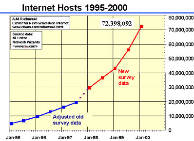
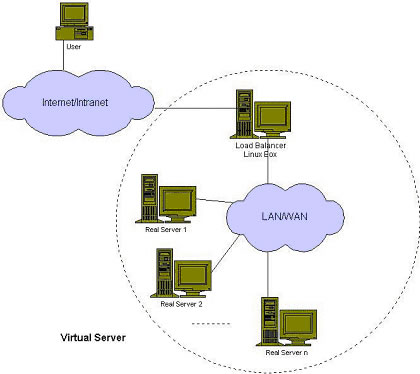
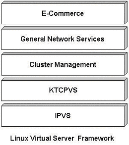

# Linux服务器集群系统

本文介绍了Linux服务器集群系统--LVS（Linux Virtual Server）项目的产生背景和目标，并描述了LVS服务器集群框架及目前提供的软件，列举LVS集群系统的特点和一些实际应用，最后，本文谈论了LVS项目的开发进展和开发感触。

## 1. 背景

当今计算机技术已进入以网络为中心的计算时期。由于客户/服务器模型的简单性、易管理性和易维护性，客户/服务器计算模式在网上被大量采用。在九十年代中 期，万维网（World Wide Web）的出现以其简单操作方式将图文并茂的网上信息带给普通大众，Web也正在从一种内容发送机制成为一种服务平台，大量的服务和应用（如新闻服务、网 上银行、电子商务等）都是围绕着Web进行。这促进Internet用户剧烈增长和Internet流量爆炸式地增长，图1显示了1995至2000年与 Internet连接主机数的变化情况[1]，可见增长趋势较以往更迅猛。

Internet的飞速发展给网络带宽和服务器带来巨大的挑战。从网络技术的发展来看，网络带宽的增长远高于处理器速度和内存访问速度的增长，如100M Ethernet、ATM、Gigabit Ethernet等不断地涌现，10Gigabit Ethernet即将就绪，在主干网上密集波分复用（DWDM）将成为宽带IP的主流技术[2,3]，Lucent已经推出在一根光纤跑800Gigabit的WaveStar? OLS 800G产品[4]。所以，我们深信越来越多的瓶颈会出现在服务器端。很多研究显示Gigabit Ethernet在服务器上很难使得其吞吐率达到1Gb/s的原因是协议栈（TCP/IP）和操作系统的低效，以及处理器的低效，这需要对协议的处理方法、操作系统的调度和IO的处理作更深入的研究。在高速网络上，重新设计单台服务器上的网络服务程序也是个重要课题。

比较热门的站点会吸引前所未有的访问流量，例如根据Yahoo的新闻发布，Yahoo已经每天发送6.25亿页面[5]。一些网络服务也收到巨额的流量， 如American Online的Web Cache系统每天处理50.2亿个用户访问Web的请求，每个请求的平均响应长度为5.5Kbytes。与此同时，很多网络服务因为访问次数爆炸式地增 长而不堪重负，不能及时处理用户的请求，导致用户进行长时间的等待，大大降低了服务质量。如何建立可伸缩的网络服务来满足不断增长的负载需求已成为迫在眉 睫的问题。

大部分网站都需要提供每天24小时、每星期7天的服务，对电子商务等网站尤为突出，任何服务中断和关键性的数据丢失都会造成直接的商业损失。例如，根据 Dell的新闻发布[6]，Dell现在每天在网站上的交易收入为一千四百万美元，一个小时的服务中断都会造成平均五十八万美元的损失。所以，这对网络服 务的可靠性提出了越来越高的要求。

现在Web服务中越来越多地使用CGI、动态主页等CPU密集型应用，这对服务器的性能有较高要求。未来的网络服务会提供更丰富的内容、更好的交互性、更高的安全性等，需要服务器具有更强的CPU和I/O处理能力。例如，通过HTTPS（Secure HTTP）取一个静态页面需要的处理性能比通过HTTP的高一个数量级，HTTPS正在被电子商务站点广为使用。所以，网络流量并不能说明全部问题，要考虑到应用本身的发展也需要越来越强的处理性能。

因此，对用硬件和软件方法实现高可伸缩、高可用网络服务的需求不断增长，这种需求可以归结以下几点：

- 可伸缩性（Scalability），当服务的负载增长时，系统能被扩展来满足需求，且不降低服务质量。
- 高可用性（Availability），尽管部分硬件和软件会发生故障，整个系统的服务必须是每天24小时每星期7天可用的。
- 可管理性（Manageability），整个系统可能在物理上很大，但应该容易管理。
- 价格有效性（Cost-effectiveness），整个系统实现是经济的、易支付的。

## 2. 服务器集群系统

对称多处理（Symmetric Multi-Processor，简称SMP）是由多个对称的处理器、和通过总线共享的内存和I/O部件所组成的计算机系统。SMP是一种低并行度的结构，是我们通常所说的"紧耦合多处理系统"，它的可扩展能力有限，但SMP的优点是单一系统映像（Single System Image），有共享的内存和I/O，易编程。

由于SMP的可扩展能力有限，SMP服务器显然不能满足高可伸缩、高可用网络服务中的负载处理能力不断增长需求。随着负载不断增长，会导致服务器不断地升 级。这种服务器升级有下列不足：一是升级过程繁琐，机器切换会使服务暂时中断，并造成原有计算资源的浪费；二是越往高端的服务器，所花费的代价越大；三是 SMP服务器是单一故障点（Single Point of Failure），一旦该服务器或应用软件失效，会导致整个服务的中断。

通过高性能网络或局域网互联的服务器集群正成为实现高可伸缩的、高可用网络服务的有效结构。这种松耦合结构的服务器集群系统有下列优点：

- 性能
网络服务的工作负载通常是大量相互独立的任务，通过一组服务器分而治之，可以获得很高的整体性能。

- 性能/价格比
组成集群系统的PC服务器或RISC服务器和标准网络设备因为大规模生产降低成本，价格低，具有最高的性能/价格比。若整体性能随着结点数的增长而接近线性增加，该系统的性能/价格比接近于PC服务器。所以，这种松耦合结构比紧耦合的多处理器系统具有更好的性能/价格比。

- 可伸缩性
集群系统中的结点数目可以增长到几千个，乃至上万个，其伸缩性远超过单台超级计算机。

- 高可用性
在硬件和软件上都有冗余，通过检测软硬件的故障，将故障屏蔽，由存活结点提供服务，可实现高可用性。

当然，用服务器集群系统实现可伸缩网络服务也存在很多挑战性的工作：

- 透明性（Transparency）
如何高效地使得由多个独立计算机组成的松藕合的集群系统构成一个虚拟服务器；客户端应用程序与集群系统交互时，就像与一台高性能、高可用的服务器交互一样，客户端无须作任何修改。部分服务器的切入和切出不会中断服务，这对用户也是透明的。

- 性能（Performance）
性能要接近线性加速，这需要设计很好的软硬件的体系结构，消除系统可能存在的瓶颈。将负载较均衡地调度到各台服务器上。

- 高可用性（Availability）
需要设计和实现很好的系统资源和故障的监测和处理系统。当发现一个模块失败时，要这模块上提供的服务迁移到其他模块上。在理想状况下，这种迁移是即时的、自动的。

- 可管理性（Manageability）
要使集群系统变得易管理，就像管理一个单一映像系统一样。在理想状况下，软硬件模块的插入能做到即插即用（Plug & Play）。

- 可编程性（Programmability）
在集群系统上，容易开发应用程序。

## 3. Linux Virtual Server项目

针对高可伸缩、高可用网络服务的需求，我们给出了基于IP层和基于内容请求分发的负载平衡调度解决方法，并在Linux内核中实现了这些方法，将一组服务器构成一个实现可伸缩的、高可用网络服务的虚拟服务器。

虚拟服务器的体系结构如图2所示，一组服务器通过高速的局域网或者地理分布的广域网相互连接，在它们的前端有一个负载调度器（Load Balancer）。负载调度器能无缝地将网络请求调度到真实服务器上，从而使得服务器集群的结构对客户是透明的，客户访问集群系统提供的网络服务就像访 问一台高性能、高可用的服务器一样。客户程序不受服务器集群的影响不需作任何修改。系统的伸缩性通过在服务机群中透明地加入和删除一个节点来达到，通过检 测节点或服务进程故障和正确地重置系统达到高可用性。由于我们的负载调度技术是在Linux内核中实现的，我们称之为Linux虚拟服务器（Linux Virtual Server）。

在1998年5月，我成立了Linux Virtual Server的自由软件项目，进行Linux服务器集群的开发工作。同时，Linux Virtual Server项目是国内最早出现的自由软件项目之一。

Linux Virtual Server项目的目标 ：使用集群技术和Linux操作系统实现一个高性能、高可用的服务器，它具有很好的可伸缩性（Scalability）、可靠性（Reliability）和可管理性（Manageability）。

目前，LVS项目已提供了一个实现可伸缩网络服务的Linux Virtual Server框架，如图3所示。在LVS框架中，提供了含有三种IP负载均衡技术的IP虚拟服务器软件IPVS、基于内容请求分发的内核Layer-7交 换机KTCPVS和集群管理软件。可以利用LVS框架实现高可伸缩的、高可用的Web、Cache、Mail和Media等网络服务；在此基础上，可以开 发支持庞大用户数的、高可伸缩的、高可用的电子商务应用。

## 3.1 IP虚拟服务器软件IPVS

在调度器的实现技术中，IP负载均衡技术是效率最高的。在已有的IP负载均衡技术中有通过网络地址转换（Network Address Translation）将一组服务器构成一个高性能的、高可用的虚拟服务器，我们称之为VS/NAT技术（Virtual Server via Network Address Translation），大多数商品化的IP负载均衡调度器产品都是使用此方法，如Cisco的LocalDirector、F5的Big/IP和 Alteon的ACEDirector。在分析VS/NAT的缺点和网络服务的非对称性的基础上，我们提出通过IP隧道实现虚拟服务器的方法VS/TUN （Virtual Server via IP Tunneling），和通过直接路由实现虚拟服务器的方法VS/DR（Virtual Server via Direct Routing），它们可以极大地提高系统的伸缩性。所以，IPVS软件实现了这三种IP负载均衡技术，它们的大致原理如下（我们将在其他章节对其工作原 理进行详细描述），

1. Virtual Server via Network Address Translation（VS/NAT）
通过网络地址转换，调度器重写请求报文的目标地址，根据预设的调度算法，将请求分派给后端的真实服务器；真实服务器的响应报文通过调度器时，报文的源地址被重写，再返回给客户，完成整个负载调度过程。

2. Virtual Server via IP Tunneling（VS/TUN）
采用NAT技术时，由于请求和响应报文都必须经过调度器地址重写，当客户请求越来越多时，调度器的处理能力将成为瓶颈。为了解决这个问题，调度器把请求报 文通过IP隧道转发至真实服务器，而真实服务器将响应直接返回给客户，所以调度器只处理请求报文。由于一般网络服务应答比请求报文大许多，采用 VS/TUN技术后，集群系统的最大吞吐量可以提高10倍。

3. Virtual Server via Direct Routing（VS/DR）
VS/DR通过改写请求报文的MAC地址，将请求发送到真实服务器，而真实服务器将响应直接返回给客户。同VS/TUN技术一样，VS/DR技术可极大地 提高集群系统的伸缩性。这种方法没有IP隧道的开销，对集群中的真实服务器也没有必须支持IP隧道协议的要求，但是要求调度器与真实服务器都有一块网卡连 在同一物理网段上。

针对不同的网络服务需求和服务器配置，IPVS调度器实现了如下八种负载调度算法：

1. 轮叫（Round Robin）
调度器通过"轮叫"调度算法将外部请求按顺序轮流分配到集群中的真实服务器上，它均等地对待每一台服务器，而不管服务器上实际的连接数和系统负载。

2. 加权轮叫（Weighted Round Robin）
调度器通过"加权轮叫"调度算法根据真实服务器的不同处理能力来调度访问请求。这样可以保证处理能力强的服务器处理更多的访问流量。调度器可以自动问询真实服务器的负载情况，并动态地调整其权值。

3. 最少链接（Least Connections）
调度器通过"最少连接"调度算法动态地将网络请求调度到已建立的链接数最少的服务器上。如果集群系统的真实服务器具有相近的系统性能，采用"最小连接"调度算法可以较好地均衡负载。

4. 加权最少链接（Weighted Least Connections）
在集群系统中的服务器性能差异较大的情况下，调度器采用"加权最少链接"调度算法优化负载均衡性能，具有较高权值的服务器将承受较大比例的活动连接负载。调度器可以自动问询真实服务器的负载情况，并动态地调整其权值。

5. 基于局部性的最少链接（Locality-Based Least Connections）
"基于局部性的最少链接" 调度算法是针对目标IP地址的负载均衡，目前主要用于Cache集群系统。该算法根据请求的目标IP地址找出该目标IP地址最近使用的服务器，若该服务器 是可用的且没有超载，将请求发送到该服务器；若服务器不存在，或者该服务器超载且有服务器处于一半的工作负载，则用"最少链接"的原则选出一个可用的服务 器，将请求发送到该服务器。

6. 带复制的基于局部性最少链接（Locality-Based Least Connections with Replication）
"带复制的基于局部性最少链接"调度算法也是针对目标IP地址的负载均衡，目前主要用于Cache集群系统。它与LBLC算法的不同之处是它要维护从一个 目标IP地址到一组服务器的映射，而LBLC算法维护从一个目标IP地址到一台服务器的映射。该算法根据请求的目标IP地址找出该目标IP地址对应的服务 器组，按"最小连接"原则从服务器组中选出一台服务器，若服务器没有超载，将请求发送到该服务器，若服务器超载；则按"最小连接"原则从这个集群中选出一 台服务器，将该服务器加入到服务器组中，将请求发送到该服务器。同时，当该服务器组有一段时间没有被修改，将最忙的服务器从服务器组中删除，以降低复制的 程度。

7. 目标地址散列（Destination Hashing）
"目标地址散列"调度算法根据请求的目标IP地址，作为散列键（Hash Key）从静态分配的散列表找出对应的服务器，若该服务器是可用的且未超载，将请求发送到该服务器，否则返回空。

8. 源地址散列（Source Hashing）
"源地址散列"调度算法根据请求的源IP地址，作为散列键（Hash Key）从静态分配的散列表找出对应的服务器，若该服务器是可用的且未超载，将请求发送到该服务器，否则返回空。

## 3.2 内核Layer-7交换机KTCPVS

在基于IP负载调度技术中，当一个TCP连接的初始SYN报文到达时，调度器就选择一台服务器，将报文转发给它。此后通过查发报文的IP和TCP报文头地 址，保证此连接的后继报文被转发到该服务器。这样，IPVS无法检查到请求的内容再选择服务器，这就要求后端服务器组提供相同的服务，不管请求被发送到哪 一台服务器，返回结果都是一样的。但是，在有些应用中后端服务器功能不一，有的提供HTML文档，有的提供图片，有的提供CGI，这就需要基于内容的调度 (Content-Based Scheduling)。

由于用户空间TCP Gateway的开销太大，我们提出在操作系统的内核中实现Layer-7交换方法，来避免用户空间与核心空间的切换和内存复制的开销。在Linux操作系统的内核中，我们实现了Layer-7交换，称之为KTCPVS（Kernel TCP Virtual Server）。目前，KTCPVS已经能对HTTP请求进行基于内容的调度，但它还不很成熟，在其调度算法和各种协议的功能支持等方面，有大量的工作需要做。

虽然应用层交换处理复杂，它的伸缩性有限，但应用层交换带来以下好处：

- 相同页面的请求被发送到同一服务器，可以提高单台服务器的Cache命中率。
- 一些研究[5]表明WEB访问流中存在局部性。Layer-7交换可以充分利用访问的局部性，将相同类型的请求发送到同一台服务器，使得每台服务器收到的请求具有更好的相似性，可进一步提高单台服务器的Cache命中率。
- 后端服务器可运行不同类型的服务，如文档服务，图片服务，CGI服务和数据库服务等。

## 4. LVS集群的特点

LVS集群的特点可以归结如下：

- 功能
有实现三种IP负载均衡技术和八种连接调度算法的IPVS软件。在IPVS内部实现上，采用了高效的Hash函数和垃圾回收机制，能正确处理所调度报文相 关的ICMP消息（有些商品化的系统反而不能）。虚拟服务的设置数目没有限制，每个虚拟服务有自己的服务器集。它支持持久的虚拟服务（如HTTP Cookie和HTTPS等需要该功能的支持），并提供详尽的统计数据，如连接的处理速率和报文的流量等。针对大规模拒绝服务（Deny of Service）攻击，实现了三种防卫策略。
有基于内容请求分发的应用层交换软件KTCPVS，它也是在Linux内核中实现。有相关的集群管理软件对资源进行监测，能及时将故障屏蔽，实现系统的高可用性。主、从调度器能周期性地进行状态同步，从而实现更高的可用性。

- 适用性
后端服务器可运行任何支持TCP/IP的操作系统，包括Linux，各种Unix（如FreeBSD、Sun Solaris、HP Unix等），Mac/OS和Windows NT/2000等。
负载调度器能够支持绝大多数的TCP和UDP协议：

|协议	|内 容|
|-|-|
|TCP	|HTTP，FTP，PROXY，SMTP，POP3，IMAP4，DNS，LDAP，HTTPS，SSMTP等|
|UDP	|DNS，NTP，ICP，视频、音频流播放协议等 |

无需对客户机和服务器作任何修改，可适用大多数Internet服务。

- 性能
LVS服务器集群系统具有良好的伸缩性，可支持几百万个并发连接。配置100M网卡，采用VS/TUN或VS/DR调度技术，集群系统的吞吐量可高达1Gbits/s；如配置千兆网卡，则系统的最大吞吐量可接近10Gbits/s。

- 可靠性
LVS服务器集群软件已经在很多大型的、关键性的站点得到很好的应用，所以它的可靠性在真实应用得到很好的证实。有很多调度器运行一年多，未作一次重启动。

- 软件许可证
LVS集群软件是按GPL（GNU Public License）许可证发行的自由软件，这意味着你可以得到软件的源代码，有权对其进行修改，但必须保证你的修改也是以GPL方式发行。

## 5. LVS集群的应用

LVS项目从成立到现在为止，受到不少关注，LVS集群系统已被应用于很多重负载的站点，就我所知该系统已在美、英、德、澳等国的几十个站点上正式使用。

我们没有上百台机器和高速的网络来实际测试LVS的终极性能，所以举LVS的应用实例来说明LVS的高性能和稳定性。我们所知的一些大型LVS应用实例如下：

- 英国国家JANET Cache Service（wwwcache.ja.net）是为英国150所以上的大学提供Web Cache服务。他们用28个结点的LVS集群代替了原有现50多台相互独立的Cache服务器，用他们的话说现在速度就跟夏天一样，因为夏天是放假期间没有很多人使用网络。

- Linux的门户站点（www.linux.com）用LVS将很多台VA Linux SMP服务器组成高性能的WEB服务，已使用将近一年。

- SourceForge（sourceforge.net）是在全球范围内为开发源码项目提供WEB、FTP、Mailing List和CVS等服务，他们也使用LVS将负载调度到十几台机器上。

- 世界上最大的PC制造商之一采用了两个LVS集群系统，一个在美洲，一个在欧洲，用于网上直销系统。

- 以RealPlayer提供音频视频服务而闻名的Real公司（www.real.com）使用由20台服务器组成的LVS集群，为其全球用户提供音频视频服务。在2000年3月时，整个集群系统已收到平均每秒20,000个连接的请求流。

- NetWalk（www.netwalk.com）用多台服务器构造LVS系统，提供1024个虚拟服务，其中本项目的一个美国镜像站点（www.us.linuxvirtualserver.org）。

- RedHat（www.redhat.com）从其6.1发行版起已包含LVS代码，他们开发了一个LVS集群管理工具叫Piranha，用于控制LVS集群，并提供了一个图形化的配置界面。

- VA Linux（www.valinux.com）向客户提供基于LVS的服务器集群系统，并且提供相关的服务和支持。

- TurboLinux的"世界一流Linux集群产品"TurboCluster实际上是基于LVS的想法和代码的，只是他们在新闻发布和产品演示时忘了致谢 。

- 红旗Linux和中软都提供基于LVS的集群解决方案，并在2000年9月召开的Linux World China 2000上展示。

在这里，再引用两位LVS用户的评论，来进一步说明LVS的性能和可靠性。

"We tried virtually all of the commercial load balancers, LVS beats them all for reliability, cost, manageability, you-name-it." — Jerry Glomph Black, Director, Internet & Technical Operations, Real Networks, Se attle Washington, USA 

http://archive.linuxvirtualserver.org/html/lvs-users/2000-03/msg00180.html 

http://marc.theaimsgroup.com/?1=linux-virtual-server&m=95385809030794&w=2

"I can say without a doubt that lvs toasts F5/BigIP solutions, at least in our real world implementations. I wouldn't trade a good lvs box for a Cisco Local Director either." — Drew Streib, Information Architect, VA Linux Systems, USA 

http://archive.linuxvirtualserver.org/html/lvs-users/2000-03/msg00178.html 

http://marc.theaimsgroup.com/?1=linux-virtual-server&m=95385694529750&w=2

## 6. LVS项目的开发进展与感触

LVS项目于1998年5月在网站上发布IPVS第一个版本源程序，一直得到了来自 Internet 的用户和开发者的鼓励和支持。应该说，刚开始发布的程序是非常简单的，由于用户的使用、反馈和期望，让我觉得这项工作的价值，并不断地化时间对该软件添加 新功能和完善，其中也得到其他开发者的帮助，所以该软件逐渐发展成为功能较齐全、有用的系统，这远远超出我当初成立项目时的想象。在这里，我要感谢 Julian Anastasov提供了很多系统的Bug fixes和改进，Joseph Mack博士编写了LVS HOWTO文档；还感谢一些厂商赞助我开发（如硬件设备等），和赞助我多次出国作相关的技术报告。

目前，正在进行的 LVS项目开发工作包括：

- 扩充IPVS对其他传输协议的支持，如AH（Authentication Header）和ESP（Encapsulating Security Payload ）等，这样IPVS调度器将实现IPSec的服务器集群。

- 提供一个统一的、功能较完善、更灵活的LVS集群管理软件。

- 扩充和改进KTCPVS的调度算法和多种协议的支持，使之功能较完备和系统更稳定。

- 在TCP粘合（TCP Splicing）和TCP转移（TCP Handoff）等方面，做一些尝试性工作，进一步改进LVS集群中的应用层调度。

最后，我谈一下自己多年来做自由软件开发的几点感触。一是通过自由软件方式可以使得软件具有顽强的生命力；我以前也做过几个独立的系统，如在SUN上用 Common Lisp开发的知识库系统和基于C++的对象数据库系统，有些地方也是做得非常漂亮的（如元级反射机制和对象的关系处理），但因为种种原因这些软件没有以 开放源码方式发布，现在它们在我导师的软件仓库里已无人问津，我也已经忘记里面的实现细节；而LVS项目是我做着玩的，一开始只是个很简单的程序，通过自 由软件的发布和开发，它发展成一个有用的、功能较齐全的软件，体现了自由软件的强大生命力。二是通过自由软件的集市开发，可以使得初始的想法不断地深入， 可以学到很多东西。三是做自由软件后时间会更有效率，由于用户的反馈和期待，会自觉不断地改进和完善系统，于是没有时间去玩游戏和网上聊天。四是做自由软 件会使得你有一点点成就感，每当收到用户的致谢和想到你的软件在实际系统中运行，会有一点满足。所以，行动起来吧，花一些时间做自由软件，你会有意想不到 的收获。

## 7. LVS项目的网络资源

如果你对LVS项目感兴趣，请访问Linux Vritual Server项目的主页（http://www.LinuxVirtualServer.org/或者http://www.linux-vs.org/），你可以获得最新的 LVS 源代码和有关运行软件，及最新的文档资料。
如果你在使用LVS 的过程中遇到困难，请订阅我们的邮件列表lvs-users@LinuxVirtualServer.org，提问、解答或者发表你的高见。

## 8. 参考文献

[1] Information Navigators, Internet Growth Charts, http://navigators.com/stats.html
[2] Srinivasan Seetharaman. IP over DWDM. http://www.cis.ohio-state.edu-/~jain/cis788-99/ip_dwdm/
[3] Lucent Technologies. Web ProForum tutorial: DWDM. October 1999, http://www.webproforum.com/acrobat/dwdm.pdf
[4] Lucent Technologies. Lucent Technologies announces record-breaking 320-channel optical networking system. April 2000, http://www.lucent.com/press/0400/000417.nsb.html
[5] Yahoo! Inc., The Yahoo! Directory and Web Services, http://www.yahoo.com/
[6] Dell Inc. http://www.dell.com/

## 9. 关于作者
章文嵩博士，开放源码及Linux内核的开发者，著名的Linux集群项目－－LVS(Linux Virtual Server)的创始人和主要开发人员。他目前工作于国家并行与分布式处理重点实验室，主要从事集群技术、操作系统、对象存储与数据库的研究。他一直在自由软件的开发上花费大量时间，并以此为乐。
