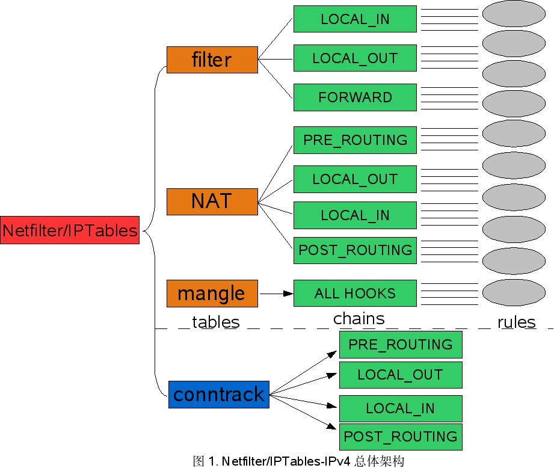
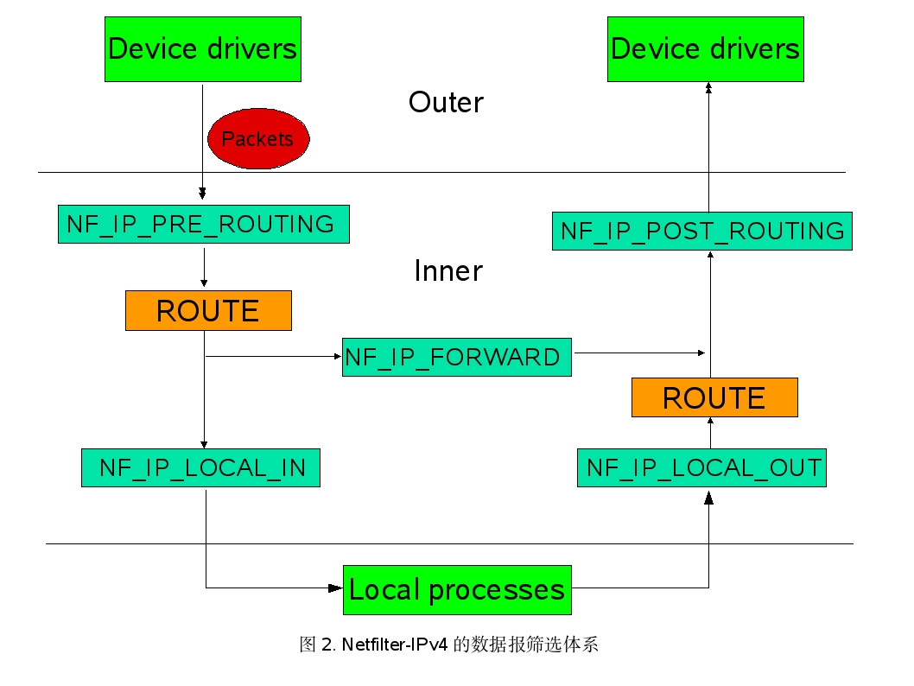
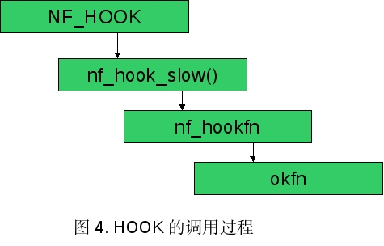

# Netfilter原理分析

## 一、概述

### 1. Netfilter/IPTables框架简介

Netfilter/IPTables是继2.0.x的IPfwadm、2.2.x的IPchains之后，新一代的Linux防火墙机制。Netfilter采用模块化设计，具有良好的可扩充性。其重要工具模块IPTables连接到Netfilter的架构中，并允许使用者对数据报进行过滤、地址转换、处理等操作。

Netfilter提供了一个框架，将对网络代码的直接干涉降到最低，并允许用规定的接口将其他包处理代码以模块的形式添加到内核中，具有极强的灵活性。

### 2. 主要源代码文件

- Linux内核版本：2.4.21
- Netfilter主文件：net/core/netfilter.c
- Netfilter主头文件：include/linux/netfilter.h
- IPv4相关：
  - c文件：net/ipv4/netfilter/*.c
  - 头文件：include/linux/netfilter_ipv4.h、include/linux/netfilter_ipv4/*.h
- IPv4协议栈主体的部分c文件，特别是与数据报传送过程有关的部分：ip_input.c，ip_forward.c，ip_output.c，ip_fragment.c等

## 二、Netfilter/IPTables-IPv4总体架构

Netfilter主要通过表、链实现规则，可以这么说，Netfilter是表的容器，表是链的容器，链是规则的容器，最终形成对数据报处理规则的实现。详细地说，Netfilter/IPTables的体系结构可以分为三个大部分：

### 1. Netfilter的HOOK机制
Netfilter的通用框架不依赖于具体的协议，而是为每种网络协议定义一套HOOK函数。这些HOOK函数在数据报经过协议栈的几个关键点时被调用，在这几个点中，协议栈将数据报及HOOK函数标号作为参数，传递给Netfilter框架。

对于它在网络堆栈中增加的这些HOOK，内核的任何模块可以对每种协议的一个或多个HOOK进行注册，实现挂接。这样当某个数据报被传递给Netfilter框架时，内核能检测到是否有任何模块对该协议和HOOK函数进行了注册。若注册了，则调用该模块的注册时使用的回调函数，这样这些模块就有机会检查、修改、丢弃该数据报及指示Netfilter将该数据报传入用户空间的队列。

这样，HOOK提供了一种方便的机制：在数据报通过Linux内核的不同位置上截获和操作处理数据报。

### 2. IPTables基础模块
IPTables基础模块实现了三个表来筛选各种数据报，具体地讲，Linux2.4内核提供的这三种数据报的处理功能是相互间独立的模块，都基于Netfilter的HOOK函数和各种表、链实现。这三个表包括：filter表，nat表以及mangle表。

### 3. 具体功能模块
- 数据报过滤模块
- 连接跟踪模块（Conntrack）
- 网络地址转换模块（NAT）
- 数据报修改模块（mangle）
- 其它高级功能模块

Netfilter/IPTables总体架构如图所示


## 三、HOOK的实现
### 1. Netfilter-IPv4中的HOOK

Netfilter模块需要使用HOOK来启用函数的动态钩接，它在IPv4中定义了五个HOOK（位于文件include/linux/netfilter_ipv4.h，Line 39），分别对应0-4的hooknum

简单地说，数据报经过各个HOOK的流程如下：

数据报从进入系统，进行IP校验以后，首先经过第一个HOOK函数NF_IP_PRE_ROUTING进行处理；然后就进入路由代码，其决定该数据报是需要转发还是发给本机的；若该数据报是发被本机的，则该数据经过HOOK函数NF_IP_LOCAL_IN处理以后然后传递给上层协议；若该数据报应该被转发则它被NF_IP_FORWARD处理；经过转发的数据报经过最后一个HOOK函数NF_IP_POST_ROUTING处理以后，再传输到网络上。本地产生的数据经过HOOK函数NF_IP_LOCAL_OUT 处理后，进行路由选择处理，然后经过NF_IP_POST_ROUTING处理后发送出去。

总之，这五个HOOK所组成的Netfilter-IPv4数据报筛选体系如图：



**注：下面所说Netfilter/IPTables均基于IPv4，不再赘述**

详细地说，各个HOOK及其在IP数据报传递中的具体位置如图;


#### NF_IP_PRE_ROUTING (0)

数据报在进入路由代码被处理之前，数据报在IP数据报接收函数ip_rcv()（位于net/ipv4/ip_input.c，Line379）的最后，也就是在传入的数据报被处理之前经过这个HOOK。在ip_rcv()中挂接这个HOOK之前，进行的是一些与类型、长度、版本有关的检查。

经过这个HOOK处理之后，数据报进入ip_rcv_finish()（位于net/ipv4/ip_input.c，Line306），进行查路由表的工作，并判断该数据报是发给本地机器还是进行转发。

在这个HOOK上主要是对数据报作报头检测处理，以捕获异常情况。

涉及功能（优先级顺序）：Conntrack(-200)、mangle(-150)、DNAT(-100)

#### NF_IP_LOCAL_IN (1)

目的地为本地主机的数据报在IP数据报本地投递函数ip_local_deliver()（位于net/ipv4/ip_input.c，Line290）的最后经过这个HOOK。

经过这个HOOK处理之后，数据报进入ip_local_deliver_finish()（位于net/ipv4/ip_input.c，Line219）

这样，IPTables模块就可以利用这个HOOK对应的INPUT规则链表来对数据报进行规则匹配的筛选了。防火墙一般建立在这个HOOK上。

涉及功能：mangle(-150)、filter(0)、SNAT(100)、Conntrack(INT_MAX-1)

#### NF_IP_FORWARD (2)

目的地非本地主机的数据报，包括被NAT修改过地址的数据报，都要在IP数据报转发函数ip_forward()（位于net/ipv4/ip_forward.c，Line73）的最后经过这个HOOK。

经过这个HOOK处理之后，数据报进入ip_forward_finish()（位于net/ipv4/ip_forward.c，Line44）

另外，在net/ipv4/ipmr.c中的ipmr_queue_xmit()函数（Line1119）最后也会经过这个HOOK。（ipmr为多播相关，估计是在需要通过路由转发多播数据时的处理）

这样，IPTables模块就可以利用这个HOOK对应的FORWARD规则链表来对数据报进行规则匹配的筛选了。

涉及功能：mangle(-150)、filter(0)

#### NF_IP_LOCAL_OUT (3)

本地主机发出的数据报在IP数据报构建/发送函数ip_queue_xmit()（位于net/ipv4/ip_output.c，Line339）、以及ip_build_and_send_pkt()（位于net/ipv4/ip_output.c，Line122）的最后经过这个HOOK。（在数据报处理中，前者最为常用，后者用于那些不传输有效数据的SYN/ACK包）

经过这个HOOK处理后，数据报进入ip_queue_xmit2()（位于net/ipv4/ip_output.c，Line281）

另外，在ip_build_xmit_slow()（位于net/ipv4/ip_output.c，Line429）和ip_build_xmit()（位于net/ipv4/ip_output.c，Line638）中用于进行错误检测；在igmp_send_report()（位于net/ipv4/igmp.c，Line195）的最后也经过了这个HOOK，进行多播时相关的处理。

这样，IPTables模块就可以利用这个HOOK对应的OUTPUT规则链表来对数据报进行规则匹配的筛选了。

涉及功能：Conntrack(-200)、mangle(-150)、DNAT(-100)、filter(0)

#### NF_IP_POST_ROUTING (4)

所有数据报，包括源地址为本地主机和非本地主机的，在通过网络设备离开本地主机之前，在IP数据报发送函数ip_finish_output()（位于net/ipv4/ip_output.c，Line184）的最后经过这个HOOK。

经过这个HOOK处理后，数据报进入ip_finish_output2()（位于net/ipv4/ip_output.c，Line160）另外，在函数ip_mc_output()（位于net/ipv4/ip_output.c，Line195）中在克隆新的网络缓存skb时，也经过了这个HOOK进行处理。

涉及功能：mangle(-150)、SNAT(100)、Conntrack(INT_MAX)

其中，入口为net_rx_action()（位于net/core/dev.c，Line1602），作用是将数据报一个个地从CPU的输入队列中拿出，然后传递给协议处理例程。

出口为dev_queue_xmit()（位于net/core/dev.c，Line1035），这个函数被高层协议的实例使用，以数据结构struct sk_buff *skb的形式在网络设备上发送数据报。

### 2. HOOK的调用

HOOK的调用是通过宏NF_HOOK实现的，其定义位于include/linux/Netfilter.h，Line122：

```
#define NF_HOOK(pf, hook, skb, indev, outdev, okfn) \
(list_empty(&nf_hooks[(pf)][(hook)]) \
? (okfn)(skb) \
: nf_hook_slow((pf), (hook), (skb), (indev), (outdev), (okfn)))
```

这里先调用list_empty函数检查HOOK点存储数组nf_hooks是否为空，为空则表示没有HOOK注册，则直接调用okfn继续处理。如果不为空，则转入nf_hook_slow()函数。

nf_hook_slow()函数（位于net/core/netfilter.c，Line449）的工作主要是读nf_hook数组遍历所有的nf_hook_ops结构，并调用nf_hookfn()处理各个数据报。

即HOOK的调用过程如图所示


下面说明一下NF_HOOK的各个参数：

- pf：协议族标识，相关的有效协议族列表位于include/linux/socket.h，Line 178。对于IPv4，应该使用协议族PF_INET；
- hook：HOOK标识，即前面所说5个HOOK对应的hooknum；
- skb：是含有需要被处理包的sk_buuff数据结构的指针。sk_buff是Linux网络缓存，指那些linux内核处理IP分组报文的缓存，即套接字缓冲区。网卡收到IP分组报文后，将它们放入sk_buff，然后再传送给网络堆栈，网络堆栈几乎一直要用到sk_buff。其定义在include/linux/skbuff.h，Line 129，下面列出我认为对分析有意义的部分成员：
  - `struct sock *sk;`：指向创建分组报文的socket；
  - `struct timeval stamp;`：分组报文到达系统的时间；
  - 下面是三个union，存放的是各层中各种协议的报文头指针：
    - h对应传输层的报头
    - nh对应网络层的报头
    - mac对应MAC层的报头
  - `unsigned int len;`：套接字缓存所代表的报文长度，即从`unsigned char *data;`的位置算起的当前有效报文长度。
  - `unsigned char pkt_type,`：表示报文的类型，具体类型定义在include/linux/if_packet.h，Line24：

  ```
#define PACKET_HOST      0 // 发送到本机的报文
#define PACKET_BROADCAST 1 // 广播报文
#define PACKET_MULTICAST 2 // 多播报文
#define PACKET_OTHERHOST 3 // 表示目的地非本机但被本机 接收的报文
#define PACKET_OUTGOING  4 // 离开本机的报文
#define PACKET_LOOPBACK  5 // 本机发给自己的报文
#define PACKET_FASTROUTE 6 // 快速路由报文
  ```

  - indev：输入设备，收到数据报的网络设备的net_device数据结构指针，即数据报到达的接口。
    - 用于NF_IP_PRE_ROUTING和NF_IP_LOCAL_IN两个HOOK
  - outdev：输出设备，数据报离开本地所要使用的网络设备的net_device数据结构指针。
    - 用于NF_IP_LOCAL_OUT和NF_IP_POST_ROUTING两个HOOK
    - 注意：在通常情况下，在一次HOOK调用中，indev和outdev中只有一个参数会被使用
  - okfn：下一步要处理的函数。即如果有HOOK函数，则处理完所有的HOOK函数，且所有向该HOOK注册过的筛选函数都返回NF_ACCEPT时，调用这个函数继续处理；如果没有注册任何HOOK，则直接调用此函数。其5个参数将由宏NF_HOOK传入。
  
### 3. HOOK点的实现

对应于各个不同协议的不同HOOK点是由一个二维数组nf_hooks存储的（位于net/core/netfilter.c，Line 47），具体的HOOK点则由数据结构nf_hook_ops（位于include/linux/netfilter.h，Line 44）实现。如图所示：


其中，nf_hook_ops成员中：

- `int priority;` priority值越小，优先级越高，相关优先级在include/linux/netfilter_ipv4.h，Line52中枚举定义：

```
enum NF_IP_hook_priorities {
NF_IP_PRI_FIRST = INT_MIN,
NF_IP_PRI_CONNTRACK= -200,
NF_IP_PRI_MANGLE = -150,
NF_IP_PRI_NAT_DST = -100,
NF_IP_PRI_FILTER = 0,
NF_IP_PRI_NAT_SRC = 100,
NF_IP_PRI_LAST = INT_MAX,
};
```

- `nf_hookfn *hook;` 为处理函数的指针，其函数指针类型定义位于include/linux/netfilter.h，Line38，为：

```
typedef unsigned int nf_hookfn(unsigned int hooknum,
struct sk_buff **skb,
const struct net_device *in,
const struct net_device *out,
int (*okfn)(struct sk_buff *));
```

这是nf_hook_ops中最关键的成员，其五个参数分别对应前面所解释的NF_HOOK中弟2到6个参数调用HOOK的包筛选函数必须返回特定的值，这些值以宏的形式定义于头文件include/linux/netfilter.h中（Line15），分别为：
  - NF_DROP(0)：丢弃此数据报，禁止包继续传递，不进入此后的处理流程；
  - NF_ACCEPT(1)：接收此数据报，允许包继续传递，直至传递到链表最后，而进入okfn函数；
    - 以上两个返回值最为常见
  - NF_STOLEN(2)：数据报被筛选函数截获，禁止包继续传递，但并不释放数据报的资源，这个数据报及其占有的sk_buff仍然有效（e.g. 将分片的数据报一一截获，然后将其装配起来再进行其他处理）；
  - NF_QUEQUE(3)：将数据报加入用户空间队列，使用户空间的程序可以直接进行处理；
    - 在nf_hook_slow()以及nf_reinject()函数（位于net/core/netfilter.c，Line449，Line505）中，当由调用nf_iterate()函数（位于net/core/netfilter.c，Line339，作用为遍历所有注册的HOOK函数，并返回相应的NF_XX值）而返回的verdict值为NF_QUEUE时（即当前正在执行的这个HOOK筛选函数要求将数据报加入用户空间队列），会调用nf_queue()函数（位于net/core/netfilter.c，Line407）
    - nf_queue()函数将这个数据报加入用户空间队列nf_info（位于include/linux/netfilter.h，Line77），并保存其设备信息以备用
  - NF_REPEAT(4)：再次调用当前这个HOOK的筛选函数，进行重复处理。
  
### 4. HOOK的注册和注销

HOOK的注册和注销分别是通过nf_register_hook()函数和nf_unregister_hook()函数（分别位于net/core/netfilter.c，Line60，76）实现的，其参数均为一个nf_hook_ops结构，二者的实现也非常简单。

nf_register_hook()的工作是首先遍历nf_hools[][]，由HOOK的优先级确定在HOOK链表中的位置，然后根据优先级将该HOOK的nf_hook_ops加入链表；

nf_unregister_hook()的工作更加简单，其实就是将该HOOK的nf_hook_ops从链表中删除。

## 四、IPTables系统
### 1. 表－规则系统

IPTables是基于Netfilter基本架构实现的一个可扩展的数据报高级管理系统，利用table、chain、rule三级来存储数据报的各种规则。系统预定义了三个table：

- filter：数据报过滤表（文件net/ipv4/netfilter/iptable_filter.c）

监听NF_IP_LOCAL_IN、NF_IP_FORWARD和NF_IP_LOCAL_OUT三个HOOK，作用是在所有数据报传递的关键点上对其进行过滤。

- nat：网络地址转换表

监听NF_IP_PRE_ROUTING、NF_IP_POST_ROUTING和NF_IP_LOCAL_OUT三个HOOK，作用是当新连接的第一个数据报经过时，在nat表中决定对其的转换操作；而后面的其它数据报都将根据第一个数据报的结果进行相同的转换处理。

- mangle：数据报修改表（位于net/ipv4/netfilter/iptable_mangle.c）

监听NF_IP_PRE_ROUTING和NF_IP_LOCAL_OUT两个HOOK，作用是修改数据报报头中的一些值。

### 2. 表的实现
表的基本数据结构是ipt_table（位于include/linux/netfilter_ipv4/ip_tables.h，Line413）:
```
struct ipt_table
{
struct list_head list; // 一个双向链表
char name[IPT_TABLE_MAXNAMELEN]; // 被用户空间使用的表函数的名字
struct ipt_replace *table; // 表初始化的模板，定义了一个初始化用的该 // 表的所默认的HOOK所包含的规则等信息，

// 用户通过系统调用进行表的替换时也要用
unsigned int valid_hooks; // 表所监听的HOOK，实质是一个位图
rwlock_t lock; // 整个表的读/写自旋锁
struct ipt_table_info *private; // 表所存储的数据信息，也就是实际的数据区，

// 仅在处理ipt_table的代码内部使用
struct module *me; // 如果是模块，那么取THIS_MODULE，否则取NULL
};
```

- `unsigned int valid_hooks;`这个位图有两个作用：一是检查Netfilter中哪些HOOK对应着合法的entries；二是用来为ipt_match以及ipt_target数据结构中的checkentry()函数核算可能的HOOK。
- `struct module *me;`当取值为THIS_MODULE时，可以阻止用户rmmod一个仍然被某个规则指向的模块的尝试。
- `struct ipt_replace *table;`的数据结构是被用户空间用来替换一个表的，其定义位于include/linux/netfilter_ipv4/ip_tables.h，Line230：

```
struct ipt_replace
{
char name[IPT_TABLE_MAXNAMELEN];
unsigned int valid_hooks;
unsigned int num_entries; // 规则表入口的数量
unsigned int size; // 新的规则表的总大小

/* Hook entry points. */
unsigned int hook_entry[NF_IP_NUMHOOKS]; // 表所监听HOOK的规则入口，

// 是对于entries[ ]的偏移
unsigned int underflow[NF_IP_NUMHOOKS]; // 规则表的最大下界
unsigned int num_counters; // 旧的计数器数目，即当前的旧entries的数目
struct ipt_counters *counters; // 旧的计数器
struct ipt_entry entries[0]; // 规则表入口
};
```

- 上文所提到的filter、nat和mangle表分别是ipt_table这个数据结构的三个实例：packet_filter（位于net/ipv4/netfilter/iptable_filter.c，Line84）、nat_table（位于net/ipv4/netfilter/ip_nat_rule.c，Line104）以及packet_mangler（位于net/ipv4/netfilter/iptable_mangle.c，Line117）

- ipt_table_info（位于net/ipv4/netfilter/ip_tables.c，Line86）是实际描述规则表的数据结构：
```
struct ipt_table_info
{
    unsigned int size;
    unsigned int number; // 表项的数目
    unsigned int initial_entries; // 初始表项数目
    unsigned int hook_entry[NF_IP_NUMHOOKS]; // 所监听HOOK的规则入口
    unsigned int underflow[NF_IP_NUMHOOKS]; // 规则表的最大下界
    char entries[0] ____cacheline_aligned; // 规则表入口，即真正的规则存储结构 // ipt_entry组成块的起始地址，对多CPU，每个CPU对应一个
};
```

### 3. 规则的实现
IPTables中的规则表可以在用户空间中使用，但它所采用的数据结构与内核空间中的是一样的，只不过有些成员不会在用户空间中使用。

一个完整的规则由三个数据结构共同实现，分别是：
- 一个ipt_entry结构，存储规则的整体信息；
- 0或多个ipt_entry_match结构，存放各种match，每个结构都可以存放任意的数据，这样也就拥有了良好的可扩展性；
- 1个ipt_entry_target结构，存放规则的target，类似的，每个结构也可以存放任意的数据。

下面将依次对这三个数据结构进行分析：

1.存储规则整体的结构ipt_entry，其形式是一个链表（位于include/linux/netfilter_ipv4/ip_tables.h，Line122）：

```
struct ipt_entry
{
    struct ipt_ip ip;
    unsigned int nfcache;
    u_int16_t target_offset;
    u_int16_t next_offset;
    unsigned int comefrom;
    struct ipt_counters counters;
    unsigned char elems[0];
};
```

其成员如下：
- `struct ipt_ip ip;`：这是对其将要进行匹配动作的IP数据报报头的描述，其定义于include/linux/netfilter_ipv4/ip_tables.h，Line122，其成员包括源/目的IP及其掩码，出入端口及其掩码，协议族、标志/取反flag等信息。
- `unsigned int nfcache;`：HOOK函数返回的cache标识，用以说明经过这个规则后数据报的状态，其可能值有三个，定义于include/linux/netfilter.h，Line23：

```
#define NFC_ALTERED 0x8000 //已改变
#define NFC_UNKNOWN 0x4000 //不确定
```
另一个可能值是0，即没有改变。

- `u_int16_t target_offset;`：指出了target的数据结构ipt_entry_target的起始位置，即从ipt_entry的起始地址到match存储结束的位置

- `u_int16_t next_offset;`：指出了整条规则的大小，也就是下一条规则的起始地址，即ipt_entry的起始地址到match偏移再到target存储结束的位置

- `unsigned int comefrom;`：所谓的“back pointer”，据引用此变量的代码（主要是net/ipv4/netfilter/ip_tables.c中）来看，它应该是指向数据报所经历的上一个规则地址，由此实现对数据报行为的跟踪

- `struct ipt_counters counters;`：说明了匹配这个规则的数据报的计数以及字节计数（定义于include/linux/netfilter_ipv4/ip_tables.h，Line100）

- `unsigned char elems[0];`：表示扩展的match开始的具体位置（因为它是大小不确定的），当然，如果不存在扩展的match那么就是target的开始位置

2.扩展match的存储结构ipt_entry_match，位于include/linux/netfilter_ipv4/ip_tables.h，Line48：

```
struct ipt_entry_match
{
    union {
        struct {
            u_int16_t match_size;
            char name[IPT_FUNCTION_MAXNAMELEN];
        } user;

        struct {
            u_int16_t match_size;
            struct ipt_match *match;
        } kernel;

        u_int16_t match_size; //总长度
    } u;

    unsigned char data[0];
};
```

其中描述match大小的`u_int16_t match_size;`，从涉及这个变量的源码看来，在使用的时候需要注意使用一个宏IPT_ALIGN（位于include/linux/netfilter_ipv4/ip_tables.h，Line445）来进行4的对齐处理（0x3 & 0xfffffffc），这应该是由于match、target扩展后大小的不确定性决定的。

在结构中，用户空间与内核空间为不同的实现，内核空间中的描述拥有更多的信息。在用户空间中存放的仅仅是match的名称，而在内核空间中存放的则是一个指向ipt_match结构的指针

结构ipt_match位于include/linux/netfilter_ipv4/ip_tables.h，Line342：

```
struct ipt_match
{
    struct list_head list;
    const char name[IPT_FUNCTION_MAXNAMELEN];
    int (*match)(const struct sk_buff *skb,
    const struct net_device *in,
    const struct net_device *out,
    const void *matchinfo, // 指向规则中match数据的指针，具体是什么数据结构依情况而定
    int offset,        // IP数据报的偏移
    const void *hdr,   // 指向协议头的指针
    u_int16_t datalen, // 实际数据长度，即数据报长度-IP头长度
    int *hotdrop);
    int (*checkentry)(const char *tablename, // 可用的表
    const struct ipt_ip *ip,
    void *matchinfo,
    unsigned int matchinfosize,
    unsigned int hook_mask);       // 对应HOOK的位图
    void (*destroy)(void *matchinfo, unsigned int matchinfosize);
    struct module *me;
};
```

其中几个重要成员：

- `int (*match)(……);`：指向用该match进行匹配时的匹配函数的指针，match相关的核心实现。返回0时hotdrop置1，立即丢弃数据报；返回非0表示匹配成功。

- `int (*checkentry)(……);`：当试图插入新的match表项时调用这个指针所指向的函数，对新的match表项进行有效性检查，即检查参数是否合法；如果返回false，规则就不会被接受（譬如，一个TCP的match只会TCP包，而不会接受其它）。

- `void (*destroy)(……);`：当试图删除一个使用这个match的表项时，即模块释放时，调用这个指针所指向的函数。我们可以在checkentry中动态地分配资源，并在destroy中将其释放。


3.扩展target的存储结构ipt_entry_target，位于include/linux/netfilter_ipv4/ip_tables.h，Line71，这个结构与ipt_entry_match结构类似，同时其中描述内核空间target的结构ipt_target（位于include/linux/netfilter_ipv4/ip_tables.h，Line375）也与ipt_match类似，只不过其中的target()函数返回值不是0/1，而是verdict。

而target的实际使用中，是用一个结构ipt_standard_target专门来描述，这才是实际的target描述数据结构（位于include/linux/netfilter_ipv4/ip_tables.h，Line94），它实际上就是一个ipt_entry_target加一个verdict。

其中成员verdict这个变量是一个很巧妙的设计，也是一个非常重要的东东，其值的正负有着不同的意义。我没有找到这个变量的中文名称，在内核开发者的新闻组中称这个变量为“a magic number”。 它的可能值包括IPT_CONTINUE、IPT_RETURN以及前文所述的NF_DROP等值，那么它的作用是什么呢？

由于IPTables是在用户空间中执行的，也就是说Netfilter/IPTables这个框架需要用户态与内核态之间的数据交换以及识别。而在具体的程序中，verdict作为`struct ipt_standard_target`的一个成员，也是对于`struct ipt_entry_target`中的target()函数的返回值。这个返回值标识的是target()所对应的执行动作，包括系统的默认动作以及外部提交的自定义动作。

但是，在用户空间中提交的数据往往是类似于“ACCPET”之类的字符串，在程序处理时则是以`#define NF_ACCEPT 1`的形式来进行的；而实际上，以上那些执行动作是以链表的数据结构进行存储的，在内核空间中表现为偏移。

于是，verdict实际上描述了两个本质相同但实现不同的值：一个是用户空间中的执行动作，另一个则是内核空间中在链表中的偏移——而这就出现了冲突。

解决这种冲突的方法就是：用正值表示内核中的偏移，而用负值来表示数据报的那些默认动作，而外部提交的自定义动作则也是用正值来表示。这样，在实际使用这个verdict时，我们就可以通过判断值的正负来进行相应的处理了。

位于net/ipv4/netfilter/ip_tables.h中的函数ipt_do_table()中有一个典型的verdict使用（Line335，其中v是一个verdict的实例）：

```
if (v !=IPT_RETURN) {
    verdict = (unsigned)(-v) - 1;
    break;
}
```

其中的IPT_RETURN定义为：

```
#define IPT_RETURN (-NF_MAX_VERDICT – 1)
```

而宏NF_MAX_VERDICT实际上就是：

```
#define NF_MAX_VERDICT NF_REPEAT
```

这样，实际上IPT_RETURN的值就是-NF_REPEAT-1，也就是对应REPEAT，这就是对执行动作的实际描述；而我们可以看到，在下面对verdict进行赋值时，它所使用的值是`(unsigned)(-v) – 1`，这就是在内核中实际对偏移进行定位时所使用的值。

那么总之呢，表和规则的实现如图所示：


从上图中不难发现，match的定位如下：

- 起始地址为：当前规则（起始）地址＋sizeof(struct ipt_entry)；
- 结束地址为：当前规则（起始）地址＋ipt_entry->target_offset；
- 每一个match的大小为：ipt_entry_match->u.match_size。

target的定位则为：

- 起始地址为match的结束地址，即：当前规则（起始）地址＋ipt_entry-> target_offset；
- 结束地址为下一条规则的起始地址，即：当前规则（起始）地址＋ipt_entry-> next_offset；
- 每一个target的大小为：ipt_entry_target->u.target_size。

这些对于理解match以及target相关函数的实现是很有必要明确的。

同时，include/linux/netfilter_ipv4/ip_tables.h中提供了三个“helper functions”，可用于使对于entry、tartget和match的操作变得方便，分别是：

- 函数ipt_get_target()：Line274，作用是取得target的起始地址，也就是上面所说的当前规则（起始）地址＋ipt_entry-> target_offset；

- 宏IPT_MATCH_ITERATE()：Line281，作用是遍历规则的所有match，并执行同一个（参数中）给定的函数。其参数为一个ipt_entry_match结构和一个函数，以及函数需要的参数。当返回值为0时，表示遍历以及函数执行顺利完成；返回非0值时则意味着出现问题已终止。

- 宏IPT_ENTRY_ITERATE()：Line300，作用是遍历一个表中的所有规则，并执行同一个给定的函数。其参数为一个ipt_entry结构、整个规则表的大小，以及一个函数和其所需参数。其返回值的意义与宏IPT_MATCH_ITERATE()类似。

- 那么如何保证传入的ipt_entry结构是整个规则表的第一个结构呢？据源码看来，实际调用这个宏的时候传入的第一个参数都是某个ipt_table_info结构的实例所指向的entries成员，这样就保证了对整个规则表的完整遍历。

### 4. 规则的使用

当一个特定的HOOK被激活时，数据报就开始进入Netfilter/IPTables系统进行遍历，首先检查`struct ipt_ip ip`，然后数据报将依次遍历各个match，也就是`struct ipt_entry_match`，并执行相应的match函数，即ipt_match结构中的*match所指向的函数。当match函数匹配不成功时返回0，或者hotdrop被置为1时，遍历将会停止。

对match的遍历完成后，会开始检查`struct ipt_entry_target`，其中如果是一个标准的target，那么会检查`struct ipt_standard_target`中的verdict，如果verdict值是正的而偏移却指向不正确的位置，那么ipt_entry中的comefrom成员就有了用武之地——数据报返回所经历的上一个规则。对于非标准的target呢，就会调用target()函数，然后根据其返回值进行后面的处理。

### 5. 规则的扩展

Netfilter/IPTables提供了对规则进行扩展的机制：可以写一个LKM来扩展内核空间的功能，也可以写一个共享库来扩展用户空间中IPTables的功能。

1. 内核的扩展

要对内核空间的功能进行扩展，实际上就是写一个具有表、match以及target增加功能的模块，相关的函数为（位于net/ipv4/netfilter/ip_tables.c，Line1318 to 1444）：

- ipt_register_table()、ipt_unregister_table()，参数为struct ipt_table *。

- ipt_register_table()函数是这三对函数中最复杂的一个，涉及了内存、信号量等方方面面的东西，但总起来说就做了初始化表以及加入双向链表两件事。

- 其复杂一是因为涉及到多CPU的处理（每个CPU拥有各自独立的“规则空间”），需要首先将新的entries放入第一个CPU空间，在检查完毕后再复制到其他CPU中；二是就是上面所说对新table各个entry的检查，包括边界检查以及完整性检查等。

  其中的重要函数有这么几个：translate_table()（位于net/ipv4/netfilter/ip_tables.c，Line797）：这个函数的主要作用是检查并应用用户空间传来的规则 :
  - 对新表进行边界检查（由宏IPT_ENTRY_ITERATE()调用函数check_entry_size_and_blocks()，位于net/ipv4/netfilter/ip_tables.c，Line732），包括对齐、过大过小等，特别是保证赋给hook_entries和underflows值的正确性。

  - 调用函数make_source_chains()（位于net/ipv4/netfilter/ip_tables.c，Line499）检查新的表中是否存在规则环，同时将HOOK的规则遍历顺序存入comefrom变量。（这个函数我没有仔细看，只是大概略了一下）

  - 对ipt_entry依次进行ipt_ip头、match以及target的完整性检查（由宏IPT_ENTRY_ITERATE()调用函数check_entry()，位于net/ipv4/netfilter/ip_tables.c，Line676），保证ipt_entry的正确性。

  - 将正确的 ipt_tables复制给其他的CPU。

 这个函数另外还在do_replace()函数（仅在一个源码中没有被调用过的函数中被调用，不予分析）中被调用。

- replace_table()（位于net/ipv4/netfilter/ip_tables.c，Line877）：这个函数的主要作用是：将得到模块初始值的ipt_table_info结构(newinfo)中的值传给ipt_table中的private，并返回ip_table中旧的private。

- list_prepend()（位于include/linux/netfilter_ipv4/listhelp.h，Line75）：在这个函数被调用之前，整个初始化的过程就已经结束了，这个函数的主要作用是：互斥地调用Linux源码中的list_add()函数（位于include/linux/list.h，Line55），将新的table加入到双向链表之中。

ipt_register_match()、ipt_unregister_match()，参数为struct ipt_match *。

ipt_register_target()、ipt_unregister_target()，参数为struct ipt_target *。

这三对函数除了ipt_register_table()外的5个函数主要就是互斥地将table/match/target加入到双向链表中或者从双向链表中删除。

其中向双向链表中加入新节点是通过调用list_named_insert()函数（位于include/linux/netfilter_ipv4/listhelp.h，Line101）实现的。这个函数的主要工作是首先确定待插入的match名字是否已经存在，只有不存在时才进行插入的操作。

用户空间的扩展

用户空间中的扩展用的是共享库配合libiptc库的机制，但这种机制是在单独的IPTbales程序中提供的，内核源码中并没有提供，这里就不做分析了。

## 五、数据报过滤模块——filter表

### 1. 概述

filter表的功能仅仅是对数据报进行过滤，并不对数据报进行任何的修改。
filter模块在Netfilter中是基于下列HOOK点的：

- NF_IP_LOCAL_IN
- NF_IP_FORWARD
- NF_IP_LOCAL_OUT

这几个HOOK分别对应着filter表中的INPUT、FORWARD、OUTPUT三条规则链，对于任何一个数据报都会经过这3个HOOK之一。

filter模块的接口位于文件net/ipv4/netfilter/iptables_filter.c中。

### 2. filter表的定义和初始化

filter表是前面所述数据结构ipt_table的一个实例，它的定义和初始化位于net/ipv4/netfilter/iptable_filter.c，Line84：

```
static struct ipt_table packet_filter
= { { NULL, NULL }, "filter", &initial_table.repl,
FILTER_VALID_HOOKS, RW_LOCK_UNLOCKED, NULL, THIS_MODULE };
```

对照结构ipt_table的定义，我们可以发现，filter表的初始化数据为：
- 链表初始化为空
- 表名为filter
- 初始化的模板为&initial_table.repl
  - 初始化的模板表定义于net/ipv4/netfilter/iptable_filter.c，Line30，是一个很简单的数据结构，只是赋值有些复杂，因为要对所涉及的各个HOOK进行不同的处理：

```
static struct
{
	struct ipt_replace repl;
	struct ipt_standard entries[3];
	struct ipt_error term;
} initial_table __initdata = {
	{ 
		"filter", FILTER_VALID_HOOKS, 4,
		sizeof(struct ipt_standard) * 3 + sizeof(struct ipt_error),
		{
			[NF_IP_LOCAL_IN] 0,
			[NF_IP_FORWARD] sizeof(struct ipt_standard),
			[NF_IP_LOCAL_OUT] sizeof(struct ipt_standard) * 2 
		},
		{ 
			[NF_IP_LOCAL_IN] 0,
			[NF_IP_FORWARD] sizeof(struct ipt_standard),
			[NF_IP_LOCAL_OUT] sizeof(struct ipt_standard) * 2 
		},
		0, 
		NULL, 
		{} 
	},
	{
		/* LOCAL_IN */
		{ { { { 0 }, { 0 }, { 0 }, { 0 }, "", "", { 0 }, { 0 }, 0, 0, 0 },0,
		sizeof(struct ipt_entry),
		sizeof(struct ipt_standard),
		0, { 0, 0 }, { } },
		{ { { { ipt_ALIGN(sizeof(struct ipt_standard_target)), "" } }, { } }, -NF_ACCEPT - 1 } },

		/* FORWARD */
		{ { { { 0 }, { 0 }, { 0 }, { 0 }, "", "", { 0 }, { 0 }, 0, 0, 0 },0,
		sizeof(struct ipt_entry),
		sizeof(struct ipt_standard),
		0, { 0, 0 }, { } },
		{ { { { ipt_ALIGN(sizeof(struct ipt_standard_target)), "" } }, { } }, -NF_ACCEPT - 1 } },

		/* LOCAL_OUT */
		{ { { { 0 }, { 0 }, { 0 }, { 0 }, "", "", { 0 }, { 0 }, 0, 0, 0 },0,
		sizeof(struct ipt_entry),
		sizeof(struct ipt_standard),
		0, { 0, 0 }, { } },
		{ { { { ipt_ALIGN(sizeof(struct ipt_standard_target)), "" } }, { } },-NF_ACCEPT - 1 } }	
	},

	/* ERROR */
	{
		{ { { 0 }, { 0 }, { 0 }, { 0 }, "", "", { 0 }, { 0 }, 0, 0, 0 },0,
		sizeof(struct ipt_entry),
		sizeof(struct ipt_error),
		0, { 0, 0 }, { } },
		{
			{ { { ipt_ALIGN(sizeof(struct ipt_error_target)), ipt_ERROR_TARGET } },{ } },
			"ERROR"
		}
	}
};
```

我们可以看到，一个initial_table包含三个成员：

- `struct ipt_replace repl;`：是对一个表进行初始化的最主要部分，这个ipt_replace结构在前面已经分析过了；

- `struct ipt_standard entries[3];`：是对这个表所监听的各个HOOK上对应的初始化信息，实际上就是一个ipt_entry结构加一个ipt_standard_target结构；

- `struct ipt_error term;`：是这个表出错时对应的信息，实际上就是一个ipt_entry结构、一个ipt_entry_target结构再加一个errorname。

当前表所监听的HOOK位图为FILTER_VALID_HOOKS，位于net/ipv4/netfilter/iptable_filter.c，Line9：

```
#define FILTER_VALID_HOOKS ((1 << NF_IP_LOCAL_IN) | (1 << NF_IP_FORWARD) | (1 << NF_IP_LOCAL_OUT))
```

我们可以看到，实际上就是IN，FORWARD和OUT。

读写锁为RW_LOCK_UNLOCKED，即为打开状态

实际数据区ipt_table_info为空

定义为模块

### 3. filter表的实现

filter表的实现函数实际上就是模块iptable_filter.o的init函数，位于net/ipv4/netfilter/iptable_filter.c，Line128。其主要工作是首先通过ipt_register_table()函数进行表的注册，然后用nf_register_hook()函数注册表所监听的各个HOOK。

其中，对HOOK进行注册时，是通过对数据结构nf_hook_ops的一个实例ipt_ops进行操作来实现的，这个实例的定义及初始化位于net/ipv4/netfilter/iptable_filter.c，Line117：

...
...

http://www.cnblogs.com/iceocean/articles/1594196.html