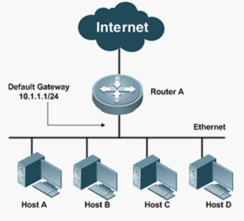
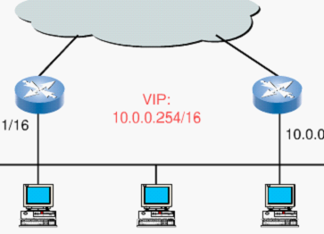
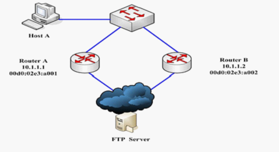
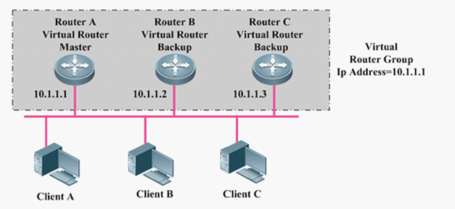
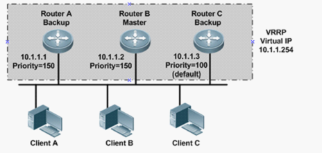
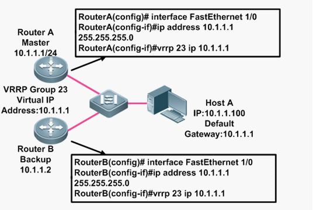
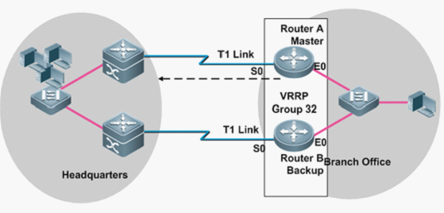
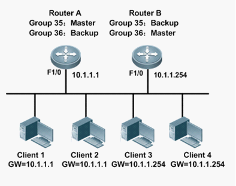
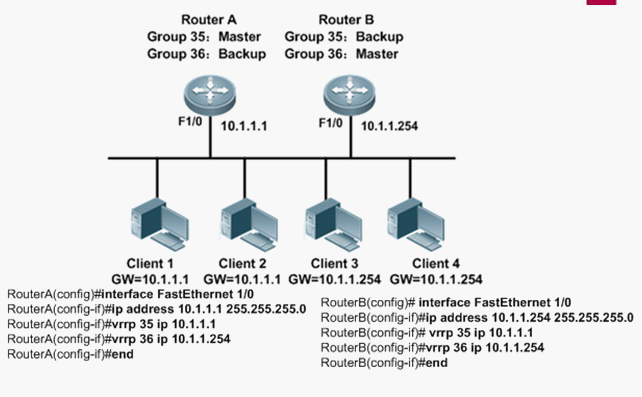

# 虚拟路由器冗余协议VRRP详解

## 为什么要使用VRRP技术
我们知道，为了实现不同子网之间的设备通信，需要配置路由。目前常用的指定路由方法有两种：

- 第一种是通过路由协议：RIP、OSPF动态学习

- 第二种是通过静态路由：对终端PC机配置静态路由。

这两种路由各有各的优缺点：

- 第一种路由可以自动寻找最优路径，邻居路由也可以通过学习来获得路由表，但是动态路由占用线路带宽和CPU处理时间。

- 第二种路由是不需要CPU处理时间同样也不占用线路带宽，但是这个路由需要对终端的PC机进行配置网关来实现，工作量是比较大的。

对于以上的两种路由在现在来说都是广泛应用的。

我们现在只来分析静态路由的缺点，因为VRRP技术就是使用在静态路由上，而不是动态路由上。

对于静态路由来说，对终端PC机配置默认网关。如果作为默认网关的路由器出现故障，所有使用该网关为下一跳的主机的通信是要中断的。如下图所示；



在上图中，主机A—D都配置了一个默认的网关：10.1.1.1，网关路由的下一跳指向主机所在网段内的一个路由器RouterA，RouterA将报文发送到外网，但是如果现在RouterA坏掉了，那么所有的主机将无法与其他网段进行通信了。

为了解决以上的问题，我们可以加一个路由器RouterB，如下图所示：



当RouterA坏掉时，所有的PC机将网关切换到RouterB上的网关。这样就实现了路由器的备份。这个技术就是VRRP技术---虚拟路由器冗余协议


## VRRP简介（转发机制）

1. VRRP（Virtual Router Redundancy Protocol，虚拟路由器冗余协议）将可以承担网关功能的路由器加入到备份组中，形成一台虚拟路由器，由VRRP的选举机制决定哪台路由器承担转发任务，局域网内的主机只需将虚拟路由器配置为缺省网关

2. VRRP是一种容错协议，在提高可靠性的同时，简化了主机的配置。在具有多播或广播能力的局域网（如以太网）中，借助VRRP 能在某台设备出现故障时仍然提供高可靠的缺省链路，有效避免单一链路发生故障后网络中断的问题，而无需修改动态路由协议、路由发现协议等配置信息

3. VRRP协议的实现有VRRPv2和VRRPv3两个版本，VRRPv2于IPv4，VRRPv3基于IPv6

4. VRRP路由器： 所有运行VRRP协议的路由器就叫做VRRP路由器

5. VRRP备份组： 多台路由器被分到一个组中，在这个组中选举出一台主路由器，其他作为备份路由器。平常时候都是主路由器一个工作，备份路由器空闲，当主路由器故障后，从多台备份路由器中选举出一台替代故障的主路由器工作。这一组中的路由器构成了一个备份组。

如下图所示： 有两个路由器，两个网关，从两个路由器中选举出一个路由器作为主路由器，其他的都是备份路由器，主路由器负责发转发数据报，而备份路由器处于空闲状态，当主路由器出现故障后，备份路由器会成为主路由器，代替主路由器实现转发功能。


6. 虚拟路由器：虚拟路由器是VRRP备份组中所有路由器的集合，它是一个逻辑概念，并不是正真存在的。从备份组外面看备份组中的路由器，感觉组中的所有路由器就像一个 一样，你可以理解为  在一个组中： 主路由器+所有备份路由器=虚拟路由器。虚拟路由器有一个虚拟的IP地址和MAC地址。如果虚拟IP和备份组中的某台路由器的IP相同的话，那么这台路由器称为IP地址拥有者，并且作为备份组中的主路由器。

   如下图所示:  RA、RB和RC都是VRRP路由器，他们构成了一个VRRP备份组，RA为主路由器，RB和RC为备份路由器，这三台路由器从外界来看就像一台一样，这样构成一个虚拟路由器Router Group，虚拟路由器有一个虚拟的ＩＰ地址为10.1.1.1（RA主路由器的IP）。RA是IP地址拥有者，也是主路由器。


7. 虚拟IP地址和MAC地址：VRRP组（备份组）中的虚拟路由器对外表现为唯一的虚拟MAC地址，地址格式为00-00-5E-00-01-【VRID】，VRID为VRRP组的编号，范围是0~255.

上图中，三台路由器在一个组中，这个组可以起一个0~255之间的编号。

注意：
 - 1.虚拟路由器具有IP地址。局域网内的主机仅需要知道这个虚拟路由器的IP地址，并将其设置为缺省路由的下一跳地址
 - 2.虚拟路由器的 IP 地址可以是备份组所在网段中未被分配的IP 地址，也可以和备份组内的某个路由器的接口IP 地址相同
 - 3.接口 IP 地址与虚拟IP 地址相同的路由器被称为“IP 地址拥有者” 在同一个 VRRP 备份组中，只允许配置一个IP 地址拥有者

## VRRP状态
VRRP路由器在运行过程中有三种状态：
1. Initialize状态： 系统启动后就进入Initialize，此状态下路由器不对VRRP报文做任何处处理，可以理解为初始化
2. Master状态： 路由器会发送VRRP通告，发送免费ARP报文。
3. Backup状态： 接受VRRP通告。

 一般主路由器处于Master状态，备份路由器处于Backup状态。
 
## VRRP选举机制

VRRP使用选举机制来确定路由器的状态，运行VRRP的一组路由器对外构成了一个虚拟路由器，其中一台路由器处于Master状态，其他处于Backup状态。所以主路由器又叫做Master路由器，备份路由器又叫做Backup路由器。

优先级选举：
1. VRRP组中IP拥有者。如果虚拟IP地址与VRRP组中的某台VRRP路由器IP地址相同，则此路由器为IP地址拥有者，这台路由器将被定位主路由器。
2. 比较优先级。如果没有IP地址拥有者，则比较路由器的优先级，优先级的范围是0~255，大的作为主路由器
3. 比较IP地址。在没有Ip地址拥有者和优先级相同的情况下，IP地址大的作为主路由器。

如下图所示： 虚拟IP为10.1.1.254，在VRRP组中没有IP地址拥有者，则比较优先级，很明显RB和RA的优先级要大于RC，则比较RA和RB的IP地址，RB的IP地址大。所以RB为组中的主路由器。


## VRRP定时器

- VRRP通告报文时间间隔定时器

1> VRRP备份组中的Master路由器会定时发送VRRP通告报文，通知备份组内的路由器自己工作正常
2> 用户可以通过设置VRRP定时器来调整Master路由器发送VRRP 通告报文的时间间隔
3> 如果Backup路由器在等待了3个间隔时间后，依然没有收到VRRP 通告报文，则认为自己是Master路由器，并对外发送VRRP通告报文，重新进行Master路由器的选举

- VRRP抢占延迟时间定时器

 1> 为了避免备份组内的成员频繁进行主备状态转换，让Backup路由器有足够的时间搜集必要的信息（如路由信息），Backup 路由器接收到优先级低于本地优 先级的通告报文后，不会立即抢占成为Master
 2> 而是等待一定时间——抢占延迟时间后，才会对外发送VRRP通告报文取代原 来的Master路由器

## VRRP报文格式
VRRP只使用VRRP通告报文。

VRRP通告报文使用Ip组播数据包进行封装，组播地址为223.0.0.18，IANA给其分配的协议号为112。
VRRP通告报文的TTL值必须是255，如果VRRP路由器接受到TTL值不为255的VRRP通告报文，必须丢弃。
VRRP组中的主路由器会定期发送通告报文，备份路由器接受，他们通过这种方式来交流选举


## VRRP工作过程总结：
1. 路由器使能VRRP 功能后，会根据优先级确定自己在备份组中的角色。优先级高的路由器成为Master 路由器，优先级低的成为Backup 路由器。Master 路由器定期发送VRRP通告报文，通知备份组内的其他设备自己工作正常；Backup 路由器则启动定时器等待通告报文的到来。

2. 在抢占方式下，当Backup 路由器收到VRRP 通告报文后，会将自己的优先级与通告报 文中的优先级进行比较。如果大于通告报文中的优先级，则成为Master 路由器；否则将保持Backup状态

3. 在非抢占方式下，只要Master 路由器没有出现故障，备份组中的路由器始终保持Master 或Backup 状态，Backup 路由器即使随后被配置了更高的优先级也不会成为Master 路由器

4. 如果Backup 路由器的定时器超时后仍未收到Master 路由器发送来的VRRP 通告报文，则认为Master 路由器已经无法正常工作，此时Backup 路由器会认为自己是Master 路由器，并对外发送VRRP 通告报文。备份组内的路由器根据优先级选举出Master 路由 器，承担报文的转发功能

## VRRP基本配置
### 配置VRRP组
要启用VRRP，最基本的配置就是要创建VRRP组，并为VRRP组配置虚拟IP地址

```
Vrrp group-number ip ip-address [secondary]
```

- group-number 为VRRP组的编号。即VRID 范围1~255,
- ip-address   虚拟IP地址。
- Secondary    辅助IP地址

需要在主路由器和备份路由器上配置


### 配置VRRP优先级

如果希望指定某台路由器称为主路由器，可以手工调整其优先级

```
Vrrp group-number priority number
```

- Group-number  VRRP组号 VIRD
- Priority      表示优先级
- Number        表示优先级 范围,0~255，默认为100，但是0被保留为特殊用途，255表示IP地址拥有者。

优先级的配置在没有IP地址拥有者的情况下。想让哪台路由器成为主路由器就在哪台路由器上配置

### 配置VRRP接口跟踪



如上图所示：RA为主路由器，RB为备份路由器，但是当RA上的接口S0发生故障时，RA依然从接口E0发送通告报文，声明自己为主路由器，但是RA实际上已经不能进行转发了。也就是说路由器网路中不能判定路由器接口是否发生了故障。

VRRP接口跟踪机制就是检测接口故障的一种机制。配置了接口跟踪机制的路由器，当自己的接口发生故障时会将自己的路由器优先级降低，从而使自己从主路由器变为备份路由器，然后原来的备份路由器此时将成为主路由器。

```
Vrrp group-nunmber track interface [priority-decrement]
```

- priority-decrement为降低的优先级数

注意： priority-decrement是降低了多少而不是降低到多少，比如priority-decrement为30，那么此路由器的优先级在原来基础上降低30.


### 配置VRRP抢占模式

抢占模式： 指当原来的路由器从故障中回复并接入到网络层后，配置了VRRP抢占模式的路由器将夺回原来属于自己的角色（主路由器），如果没有配置，回复之后将保持备份路由器的状态。

推荐使用启用抢占模式

```
vrrp group-number preempt  {delay [Delay-time] }
```

- Delay  取值范围为1～255之间，如果不配置delay时间，那么其默认值为0秒。
- delay-time 为延迟抢占的时间即从该路由器发现自己的优先级大于MASTER的优先级开始 经过delay-time这样长的一段时间之后才允许抢占。

在主路由器中配置该命令

### 配置VRRP定时器
  VRRP定时器可以修改通告报文的发送时间
```
vrrp group-number timers advertise vrrp-advertise-interval
```
- adver_interval 为设置定时器adver_timer的时间间隔。MASTER每隔这样一个时间间隔，就会发送一个advertisement报文以通知组内其他路由器自己工作正常，
- vrrp-advertise-interval 的取值范围为0～254。

在主路由器上配置

### 配置VRRP定时学习功能
   配置此命令的路由器会学习发送通告报文时间，进而计算出失效间隔，否则默认3s，

这条命令对于上面的配置VRRP定时器，在主路由器中配置了发送时间间隔，那么在备份路由器上就需要配置定时学习功能来计算失效间隔，因为失效间隔是发送时间的3倍
```
vrrp group-number times learn
```

### VRRP负载均衡

在一组VRRP组中，主路由器承担数据转发任务的同时，备份路由器的链路将处于空闲状态，这必然造成了带宽资源的浪费。为了避免这种浪费，使用VRRP负载均衡。
VRRP负载均衡是通过实现将路由器加入到多个VRRP组实现的，使VRRP路由器在不同的组中担任不同的角色。

如下图所示：

- RA为组35的主路由器，同时又是组36的备份路由器
- RB为组36的主路由器，同时又是组35的备份路由器。

在正常状态下，PC1、PC2走RA，PC3和PC4走RB，但是两个路由器一旦出现故障，就将网关切换到备份路由器。RA和RB可以说是相辅相成的。

VRRP并不具备对流量进行监控的机制，它的负载均衡只是通过使用多个VRRP组来实现的。




  
